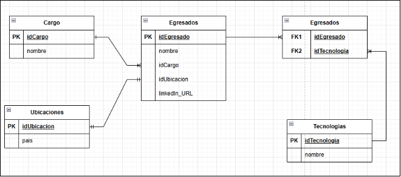
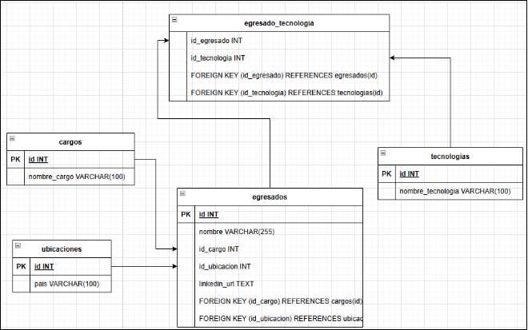



**UNIVERSIDAD PRIVADA DE TACNA FACULTAD DE INGENIERÍA**

**Escuela Profesional de Ingeniería de Sistemas**

**Diccionario de datos**

**Sistema de análisis del Perfil Profesional de los Egresados de la EPIS de la UPT en LinkedIn**

Curso: *Inteligencia de Negocios*

Docente: *Mag. Patrick Cuadros Quiroga* Integrantes:

- Christian Dennis Hinojosa		(2019065161)
- Danilo Chite Quispe			(2021070015)
- Royser Villanueva Mamani		(2021071090)

**Tacna – Perú 2025**

**Sistema de análisis del Perfil Profesional de los Egresados de la EPIS de la UPT en LinkedIn**

**Diccionario de Datos**

**Versión *1.0***

# **Índice General**
[1.	Modelo Entidad / relación	4****](#_toc200470747)**

[**1.1.	Diseño lógico	4****](#_toc200470748)

[**1.2.	Diseño Físico	4****](#_toc200470749)

[**2.	DICCIONARIO DE DATOS	5****](#_toc200470750)

[**2.1.	Tablas	5****](#_toc200470751)

[**2.3.	Lenguaje de Definición de Datos	7****](#_toc200470752)

[**2.4.	Lenguaje de Manipulación de Datos (DML)	7****](#_toc200470753)

**Diccionario de Datos**

1. # **Modelo Entidad / relación**

1. # **Diseño lógico**

1. # **Diseño Físico**

1. # **DICCIONARIO DE DATOS**

1. # **Tablas**

|**Nombre de la Tabla:**|Cargos||||||
| :- | :- | :- | :- | :- | :- | :- |
|**Descripción de la Tabla:**|Registro de cargos laborales que pueden tener los egresados.||||||
|` `**Objetivo:**|Almacenar los distintos cargos o posiciones laborales ocupados por los egresados.||||||
|**Relaciones con otras Tablas:**|egresados||||||
|**Descripción de los campos**|||||||
|

**Nro.**
|
**Nombre del**

**campo**
|**Tipo dato longitud**|**Permite nulos**|**Clave primaria**|**Clave foránea**|

**Descripción del campo**
|
|1|Id|INT (IDENTITY)|No|Sí|No|Identificador único del cargo|
|2|nombre|VARCHAR(100)|No|No|No|Nombre del cargo laboral|

|**Nombre de la Tabla:**|Ubicaciones||||||
| :- | :- | :- | :- | :- | :- | :- |
|**Descripción de la Tabla:**|Registro de ubicaciones geográficas de los egresados.||||||
|` `**Objetivo:**|Almacenar los países de residencia o ubicación laboral de los egresados.||||||
|**Relaciones con otras Tablas:**|egresados||||||
|**Descripción de los campos**|||||||
|

**Nro.**
|
**Nombre del**

**campo**
|**Tipo dato longitud**|**Permite nulos**|**Clave primaria**|**Clave foránea**|

**Descripción del campo**
|
|1|Id|INT (IDENTITY)|No|Sí|No|Identificador único de la ubicación|
|2|pais|VARCHAR(100)|No|No|No|Nombre del país de ubicación|

|**Nombre de la Tabla:**|Tecnologías||||||
| :- | :- | :- | :- | :- | :- | :- |
|**Descripción de la Tabla:**|Registro de tecnologías manejadas por los egresados.||||||
|` `**Objetivo:**|Almacenar las diferentes tecnologías que los egresados dominan o han utilizado.||||||
|**Relaciones con otras Tablas:**|egresado\_tecnologia||||||
|**Descripción de los campos**|||||||
|

**Nro.**
|
**Nombre del**

**campo**
|**Tipo dato longitud**|**Permite nulos**|**Clave primaria**|**Clave foránea**|

**Descripción del campo**
|
|1|Id|INT (IDENTITY)|No|Sí|No|Identificador único de la tecnología|
|2|nombre\_tecnologia|VARCHAR(100)|No|No|No|Nombre de la tecnología usada por el egresado|

|**Nombre de la Tabla:**|Egresados ||||||
| :- | :- | :- | :- | :- | :- | :- |
|**Descripción de la Tabla:**|Registro principal de egresados de la universidad.||||||
|` `**Objetivo:**|Almacenar los datos generales de cada egresado y su ubicación y cargo laboral.||||||
|**Relaciones con otras Tablas:**|Cargos, ubicaciones, egresado\_tecnologia||||||
|**Descripción de los campos**|||||||
|

**Nro.**
|
**Nombre del**

**campo**
|**Tipo dato longitud**|**Permite nulos**|**Clave primaria**|**Clave foránea**|

**Descripción del campo**
|
|1|Id|INT (IDENTITY)|No|Sí|No|Identificador único del egresado|
|2|nombre|VARCHAR(255)|No|No|No|Nombre completo del egresado|
|3|id\_cargo|INT|No|No|Si|Referencia al cargo que ocupa el egresado|
|4|id\_ubicacion|INT|No|No|Si|Referencia a la ubicación geográfica del egresado|
|5|linkedin\_url|TEXT|Si|No|No|Enlace al perfil de LinkedIn del egresado|

|**Nombre de la Tabla:**|` `Egresado\_tecnologia ||||||
| :- | :- | :- | :- | :- | :- | :- |
|**Descripción de la Tabla:**|Tabla intermedia que relaciona egresados con las tecnologías que dominan.||||||
|` `**Objetivo:**|` `Representar la relación muchos a muchos entre egresados y tecnologías.||||||
|**Relaciones con otras Tablas:**|Egresados, tecnologías ||||||
|**Descripción de los campos**|||||||
|

**Nro.**
|
**Nombre del**

**campo**
|**Tipo dato longitud**|**Permite nulos**|**Clave primaria**|**Clave foránea**|

**Descripción del campo**
|
|1|Id\_egresado|INT (IDENTITY)|No|Sí|No|Referencia al egresado|
|2|Id\_tecnologia|INT|No|No|Sí|Referencia a la tecnología asociada|

1. **Procedimientos Almacenados**

Actualmente, no se han definido procedimientos almacenados dentro de la base de datos, sin embargo, se prevé el uso de estos en una siguiente actualización del documento. 

1. # **Lenguaje de Definición de Datos** 
   CREATE DATABASE egresados\_upt;

   GO

   USE egresados\_upt;

   GO

   -- Tabla cargos

   CREATE TABLE cargos (

   `    `id INT PRIMARY KEY,

   `    `nombre\_cargo VARCHAR(100)

   );

   -- Tabla ubicaciones (solo país)

   CREATE TABLE ubicaciones (

   `    `id INT PRIMARY KEY,

   `    `pais VARCHAR(100)

   );

   -- Tabla tecnologias

   CREATE TABLE tecnologias (

   `    `id INT PRIMARY KEY,

   `    `nombre\_tecnologia VARCHAR(100)

   );

   -- Tabla egresados

   CREATE TABLE egresados (

   `    `id INT PRIMARY KEY,

   `    `nombre VARCHAR(255),

   `    `id\_cargo INT,

   `    `id\_ubicacion INT,

   `    `linkedin\_url TEXT,

   `    `FOREIGN KEY (id\_cargo) REFERENCES cargos(id),

   `    `FOREIGN KEY (id\_ubicacion) REFERENCES ubicaciones(id)

   );

   -- Tabla puente

   CREATE TABLE egresado\_tecnologia (

   `    `id\_egresado INT,

   `    `id\_tecnologia INT,

   `    `FOREIGN KEY (id\_egresado) REFERENCES egresados(id),

   `    `FOREIGN KEY (id\_tecnologia) REFERENCES tecnologias(id)

   );

1. # **Lenguaje de Manipulación de Datos (DML)**

-- Insertar cargos

INSERT INTO cargos (id, nombre\_cargo) VALUES (1, 'Analista de Sistemas');

INSERT INTO cargos (id, nombre\_cargo) VALUES (2, 'Consultor TI');

INSERT INTO cargos (id, nombre\_cargo) VALUES (3, 'Desarrollador de Software');

…

-- Insertar ubicaciones (países)

INSERT INTO ubicaciones (id, pais) VALUES (1, 'EEUU');

INSERT INTO ubicaciones (id, pais) VALUES (2, 'España');

INSERT INTO ubicaciones (id, pais) VALUES (3, 'Peru');

…

-- Insertar tecnologías

INSERT INTO tecnologias (id, nombre\_tecnologia) VALUES (1, 'C#');

INSERT INTO tecnologias (id, nombre\_tecnologia) VALUES (2, 'CSS');

INSERT INTO tecnologias (id, nombre\_tecnologia) VALUES (3, 'Django');

INSERT INTO tecnologias (id, nombre\_tecnologia) VALUES (4, 'HTML');

INSERT INTO tecnologias (id, nombre\_tecnologia) VALUES (5, 'Java');

…

-- Insertar egresados

INSERT INTO egresados (id, nombre, id\_cargo, id\_ubicacion, linkedin\_url) VALUES (1, 'VILMA CONDORI CHURATA', 7, 3, 'https://www.linkedin.com/in/vilma-condori-churata-12b2ab78/');

INSERT INTO egresados (id, nombre, id\_cargo, id\_ubicacion, linkedin\_url) VALUES (2, 'ROSARIO LUZ VELASQUEZ ESPEJO', 8, 3, 'nan');

INSERT INTO egresados (id, nombre, id\_cargo, id\_ubicacion, linkedin\_url) VALUES (3, 'CLAUDIA XIOMARA SALAS MONTENEGRO', 7, 3, 'https://www.linkedin.com/in/claudia-salasm/');

…

-- Insertar relación egresado-tecnología

INSERT INTO egresado\_tecnologia (id\_egresado, id\_tecnologia) VALUES (21, 1);

INSERT INTO egresado\_tecnologia (id\_egresado, id\_tecnologia) VALUES (21, 5);

INSERT INTO egresado\_tecnologia (id\_egresado, id\_tecnologia) VALUES (21, 6);

INSERT INTO egresado\_tecnologia (id\_egresado, id\_tecnologia) VALUES (21, 7);

…
