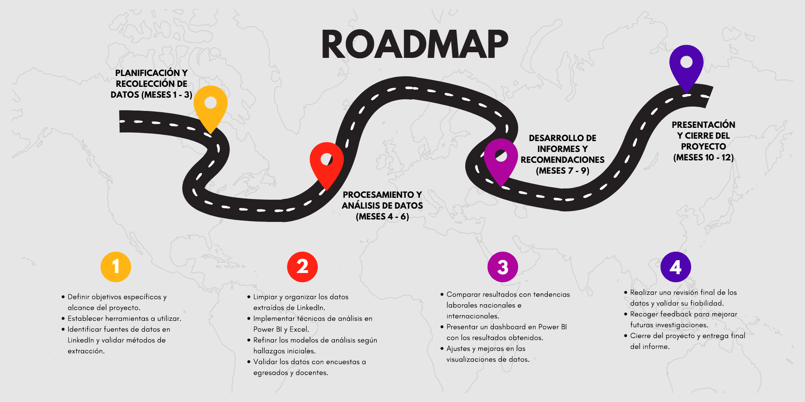

[comment]: 

**UNIVERSIDAD PRIVADA DE TACNA**

**FACULTAD DE INGENIERIA**

**Escuela Profesional de Ingeniería de Sistemas**

**Proyecto *Sistema de Análisis del Perfil Profesional de los Egresados de la EPIS de la UPT en LinkedIn***

Curso: **Inteligencia de Negocios**

Docente: **Mag. Patrick José Cuadros Quiroga**
     
## Integrantes:

  **Villanueva Mamani, Royser Alonsso (2021071090)** 
  **Hinojosa Mucho, Christian Dennis (2019065161)** 
  **Chite Quispe, Brian Danilo (2021070015)** 

**Tacna – Perú**

***2025***

\pagebreak

|CONTROL DE VERSIONES||||||
| :-: | :- | :- | :- | :- | :- |
|Versión|Hecha por|Revisada por|Aprobada por|Fecha|Motivo|
|1\.0|MPV|ELV|ARV|10/10/2020|Versión Original|

# Sistema de Análisis del Perfil Profesional de los Egresados de la EPIS de la UPT en LinkedIn

## Informe de Visión

**Versión 1.0**

      
# ÍNDICE GENERAL

1. **Introducción** ................................................. 4  
   1.1. Propósito ..................................................... 4  
   1.2. Alcance ....................................................... 4  
   1.3. Definición, Siglas y Abreviaturas ............................ 4  
   1.4. Referencias ................................................... 4  
   1.5. Visión General ................................................ 4  

2. **Posicionamiento** ............................................... 4  
   2.1. Oportunidad de negocio ...................................... 4  
   2.2. Definición del problema .................................... 4  

3. **Descripción de los interesados y usuarios** .................. 4  
   3.1. Resumen de los interesados ................................ 4  
   3.2. Resumen de los usuarios ................................... 4  
   3.3. Entorno de usuario ......................................... 4  
   3.4. Perfiles de interesados .................................... 4  
   3.5. Perfiles de usuarios ....................................... 4  
   3.6. Necesidades de los interesados y usuarios ................. 4  

4. **Vista General del Producto** .................................. 4  
   4.1. Perspectiva del producto .................................... 4  
   4.2. Resumen de capacidades .................................... 4  
   4.3. Suposiciones y dependencias ................................ 4  
   4.4. Costos y precios ............................................ 4  
   4.5. Licenciamiento e instalación ............................... 4  

5. **Características del Producto** ................................ 4  
6. **Restricciones** ................................................. 4  
7. **Rangos de calidad** ............................................ 4  
8. **Precedencia y Prioridad** ..................................... 4  

9. **CONCLUSIONES** ................................................... 5  
10. **RECOMENDACIONES** ................................................. 5  
11. **BIBLIOGRAFÍA** .................................................... 5

# Informe de Análisis de Perfiles Profesionales de Egresados de la UPT en LinkedIn

## 1. Introducción

### 1.1. Propósito
El propósito es analizar el perfil profesional de los egresados de la Universidad Privada de Tacna (UPT) de la Escuela Profesional de Ingeniería de Sistemas en LinkedIn para identificar tendencias laborales, sectores predominantes y oportunidades de mejora en la formación académica.

### 1.2. Alcance
Este informe abarca el análisis de los perfiles profesionales de los egresados de la Escuela Profesional de Ingeniería de Sistemas (EPIS) de la Universidad Privada de Tacna (UPT) en LinkedIn. Se tratarán los siguientes puntos:
- Sectores y roles en los que se insertan laboralmente los egresados.
- Habilidades técnicas y blandas más mencionadas en los perfiles.
- Distribución de los egresados según sus años de experiencia laboral.
- Países y ciudades donde se encuentran trabajando los egresados.

### 1.3. Definición, Siglas y Abreviaturas
- **EPIS**: Escuela Profesional de Ingeniería de Sistemas. Unidad académica de la Universidad Privada de Tacna (UPT) encargada de la formación en ingeniería de sistemas.
- **UPT**: Universidad Privada de Tacna. Institución de educación superior en la que han egresado los profesionales analizados en este informe.
- **LinkedIn**: Red social profesional utilizada para conectar a empresas y trabajadores, permitiendo la publicación de experiencias laborales, habilidades y formación académica.
- **Perfil Profesional**: Conjunto de información publicada en LinkedIn por un egresado, incluyendo su formación académica, experiencia laboral, habilidades y certificaciones.

### 1.4. Referencias
Los documentos que se van a utilizar como referencia serán los siguientes:
- Documento de Especificación de Requerimientos – SRS
- Documento de Arquitectura de Software – SAD
- Documento de Informe de Factibilidad

### 1.5. Visión General
Este documento describe el propósito, alcance, características y restricciones del sistema, junto con los perfiles de los usuarios interesados y las capacidades requeridas.

## 2. Posicionamiento

### 2.1. Oportunidad de negocio
El análisis de los perfiles de los egresados de la UPT en LinkedIn representa una oportunidad para mejorar la empleabilidad de los egresados y ajustar la oferta académica a las demandas del mercado laboral. Además, posiciona a la UPT como una institución que responde a las necesidades del sector empresarial, lo que puede atraer a nuevos estudiantes y fortalecer alianzas estratégicas con empresas que buscan talento calificado.

### 2.2. Definición del problema
Existe una falta de información estructurada sobre la trayectoria laboral de los egresados de la UPT, lo que dificulta evaluar su empleabilidad, sectores laborales predominantes, habilidades más demandadas y ubicación geográfica. Esto limita la capacidad de la universidad para ajustar su oferta académica y mejorar la orientación profesional de los estudiantes.

## 3. Descripción de los interesados y usuarios

### 3.1. Resumen de los interesados

| Interesados                       | Representante                     | Papel                                        |
|------------------------------------|-----------------------------------|----------------------------------------------|
| Royser Alonsso Villanueva Mamani   | Jefe de proyecto                  | Responsable de la gestión del proyecto      |
| Christian Dennis Hinojosa          | Analista y programador            | Responsable del alcance del proyecto        |
| Brian Danilo Chite                 | Analista y programador            | Responsable del alcance y módulos del proyecto |

### 3.2. Resumen de los usuarios

| Nombre                      | Descripción                                                                 |
|-----------------------------|-----------------------------------------------------------------------------|
| Docentes de la EPIS          | Pueden aprovechar los resultados del análisis para actualizar sus metodologías de enseñanza y reforzar las competencias más demandadas en el mercado. |
| Estudiantes de la EPIS       | Obtendrán una visión clara sobre las áreas de especialización más valoradas y las oportunidades de empleo disponibles tras su graduación. |
| Egresados de la EPIS         | Profesionales que desean conocer las oportunidades laborales y las competencias más valoradas en el mercado para mejorar su empleabilidad. |

### 3.3. Entorno de usuario
Este informe estará dirigido a diversos actores dentro y fuera de la Universidad Privada de Tacna (UPT), quienes lo consultarán para distintos fines académicos, laborales y estratégicos.

# 3.4. Perfiles de interesados

## Perfil de Interesado

| **Representante**         | **Jefe de proyecto**                                           |
|---------------------------|---------------------------------------------------------------|
| **Descripción**            | Encargado de supervisar la gestión del proyecto               |
| **Tipo**                   | Líder del proyecto                                            |
| **Responsabilidades**      | Supervisa el estado del proyecto y su manejo hasta la conclusión del mismo. |
| **Criterios**              | El éxito es la finalización del proyecto dentro del tiempo estimado. También debe haber una percepción general del proyecto satisface las necesidades de todos los interesados. |
| **Implicación**            | Revisor de requisitos y supervisor del proyecto               |
| **Entregables**            | Ninguno                                                       |

## Perfil de Interesado

| **Representante**         | **Docentes de la EPIS**                                        |
|---------------------------|---------------------------------------------------------------|
| **Descripción**            | Responsables de la formación académica de los estudiantes de Ingeniería de Sistemas. |
| **Tipo**                   | Apoyo del proyecto                                            |
| **Responsabilidades**      | Guiar a los estudiantes en su desarrollo profesional. Ofrecernos datos acerca de los egresados de la escuela. |
| **Criterios**              | Relevancia de las habilidades enseñadas. Impacto de la enseñanza en la empleabilidad. |
| **Implicación**            | Orientación a los estudiantes                                  |
| **Entregables**            | Ninguna                                                       |

# 3.5. Perfiles de usuarios

## Perfil de Usuario

| **Representante**         | **Estudiantes de la EPIS**                                     |
|---------------------------|---------------------------------------------------------------|
| **Descripción**            | Futuros profesionales que buscan orientación sobre su perfil profesional y oportunidades de empleo. |
| **Tipo**                   | Beneficiarios                                                  |
| **Responsabilidades**      | Identificar las competencias clave para el mercado laboral. Prepararse para la búsqueda de empleo. |
| **Criterios**              | Accesibilidad a la información sobre tendencias de empleabilidad. Claridad en las habilidades requeridas. |
| **Implicación**            | Son los principales beneficiarios de la mejora educativa y orientación laboral. |
| **Entregables**            | Ninguna                                                       |

# 3.6. Necesidades de los interesados y usuarios

| **Necesidades**                                                    | **Prioridad** | **Inquietudes**                                               | **Solución Actual**                                          | **Solución Propuesta**                                        |
|-------------------------------------------------------------------|---------------|---------------------------------------------------------------|-------------------------------------------------------------|-------------------------------------------------------------|
| Conocer las habilidades y competencias más valoradas en LinkedIn y el mercado laboral. | Alta          | Desconocimiento de las habilidades más demandadas por las empresas. | Búsqueda individual en LinkedIn y portales de empleo.        | Análisis de tendencias en LinkedIn. Talleres y charlas sobre empleabilidad. |
| Evaluar su propio perfil profesional en relación con otros egresados de la EPIS. | Media         | Falta de referencias sobre cómo debe lucir un perfil exitoso. Comparación con otros profesionales sin información estructurada. | Observación de perfiles de otros egresados de manera individual. | Creación de informes comparativos con datos concretos sobre los egresados. |
| Identificar oportunidades de mejora y formación continua.         | Alta          | Falta de claridad sobre qué certificaciones o especializaciones tomar. No conocer las tendencias en formación complementaria. | Revisión de cursos en plataformas como Udemy, Coursera o LinkedIn Learning sin orientación específica. | Recomendaciones personalizadas basadas en el análisis de perfiles exitosos. |
| Optimizar su perfil de LinkedIn para mejorar su visibilidad ante reclutadores. | Alta          | Perfiles incompletos o mal estructurados. Desconocimiento de estrategias de visibilidad y networking. | Publicación esporádica de información en LinkedIn. Uso limitado de palabras clave y secciones clave del perfil. | Guías y talleres sobre optimización de LinkedIn. Implementación de mentorías con egresados exitosos. |
  

## 4. Vista General del Producto

### 4.1. Perspectiva del producto
El análisis de los perfiles profesionales de los egresados de la EPIS de la UPT en LinkedIn se posiciona como una herramienta clave para mejorar la empleabilidad de los estudiantes y ajustar el currículo a las demandas del mercado laboral. Al proporcionar datos actualizados sobre la inserción laboral de los egresados, este producto también fortalecerá el posicionamiento de la UPT en el mercado educativo, demostrando su respuesta activa a las necesidades del sector empresarial.

### 4.2. Resumen de capacidades
- **Análisis de Datos**: Habilidad para recolectar, procesar y analizar grandes volúmenes de datos provenientes de los perfiles de LinkedIn. Esto incluye la identificación de patrones y tendencias relacionadas con sectores laborales, roles profesionales y habilidades demandadas.
- **Comunicación y Presentación de Resultados**: Habilidad para comunicar los hallazgos del análisis de manera clara y efectiva, utilizando informes detallados y presentaciones visuales (gráficos, tablas) que puedan ser fácilmente comprendidos por los interesados (docentes, estudiantes, egresados y autoridades de la universidad).
- **Herramientas de Big Data y Análisis**: Conocimiento de herramientas y software de análisis de datos el cual se va a procesar y visualizar la información obtenida de los perfiles de LinkedIn.

### 4.3. Suposiciones y dependencias
-	**Disponibilidad de Datos Públicos en LinkedIn:** Se asume que los perfiles de los egresados de la EPIS de la UPT en LinkedIn serán públicos y accesibles para el análisis. Esto incluye la disponibilidad de información relevante como formación académica, experiencia laboral y habilidades.
- **Consentimiento para el Uso de Datos:** Se asume que el análisis de los perfiles se hará respetando la privacidad de los usuarios y conforme a las políticas de LinkedIn, garantizando el uso ético de la información.
- **Acceso a Herramientas de Análisis:** El proyecto depende de contar con acceso a herramientas y software adecuados (como Excel, o Python) para procesar y analizar los datos de manera eficiente.
- **Actualización de la Información:** Se depende de la actualización constante de los perfiles en LinkedIn, lo que permitirá obtener datos representativos y actuales sobre la inserción laboral de los egresados.

### 4.4. Costos y precios

El proyecto se fundamenta en herramientas de bajo costo, lo que lo hace viable sin necesidad de grandes inversiones. La mayor inversión será en tiempo de desarrollo y análisis de datos, ya que la infraestructura y el software requerido están disponibles de manera gratuita o con licencias abiertas.

Para determinar con mayor precisión la viabilidad financiera del proyecto, estos costos serán reflejados en el estudio de factibilidad.

---

### 4.5. Licenciamiento e instalación

El software desarrollado será de código abierto, permitiendo a futuros investigadores mejorarlo. Se instalará en entornos compatibles con Python y Power BI.

**Requisitos de instalación**

Para que el sistema funcione correctamente, se deben cumplir los siguientes requisitos:

**Software necesario:**
- Google Chrome y ChromeDriver para la automatización del Web Scraping.
- Microsoft Power BI (versión gratuita o Pro) para la visualización de datos.
- Acceso a internet para la extracción de datos desde LinkedIn.

**Hardware recomendado:**
- Procesador: Intel Core i5 o superior
- Memoria RAM: 8 GB o más
- Espacio en disco: Al menos 10 GB libres
- Sistema Operativo: Windows 10/11

## 5. Características del Producto

El sistema desarrollado permitirá realizar un análisis detallado del perfil profesional de los egresados de Ingeniería de Sistemas de la UPT en LinkedIn, proporcionando información útil para mejorar la empleabilidad de futuros egresados y optimizar el currículo académico.

### Características principales

**Extracción automática de datos de LinkedIn**
- Obtención de información de perfiles públicos mediante Web Scraping con Selenium y BeautifulSoup en Python.
- Datos recopilados: nombre, cargo actual, empresa, ubicación, habilidades mencionadas, sector laboral.

**Almacenamiento y procesamiento de datos**
- Datos organizados en bases de datos SQL para un análisis estructurado.
- Formatos de exportación: CSV, Excel (XLSX).

**Visualización y análisis en Power BI**
- Creación de gráficos dinámicos para identificar tendencias laborales, sectores predominantes y habilidades clave.
- Uso de Mapas Geográficos para analizar la distribución de egresados.

**Generación de informes y recomendaciones**
- Reportes detallados sobre competencias laborales más valoradas.
- Propuestas para actualizar la formación académica en base a las demandas del mercado.

**Código abierto y escalable**
- Licencia MIT que permite mejoras futuras y contribuciones de la comunidad académica.

---

## 6. Restricciones

El desarrollo del sistema está sujeto a ciertas limitaciones técnicas y operativas, que pueden influir en su funcionalidad y alcance.

### Restricciones del proyecto

**Restricciones en la extracción de datos**
- LinkedIn tiene políticas estrictas contra el Web Scraping, lo que puede limitar la cantidad de información accesible.
- Solo se analizarán perfiles públicos, sin acceso a datos privados o restringidos.

**Dependencia de herramientas de terceros**
- El sistema requiere Google Chrome y ChromeDriver para la extracción de datos.
- Power BI es necesario para la visualización de los datos, lo que puede requerir una cuenta de Microsoft.

**Calidad y disponibilidad de los datos**
- Los datos obtenidos dependen de la precisión con la que los egresados actualizan sus perfiles.
- Puede haber perfiles incompletos o con información desactualizada.

**Capacidad de procesamiento**
- El tiempo de ejecución del Web Scraping puede variar dependiendo de la cantidad de datos extraídos.

---

## 7. Rangos de Calidad

Para garantizar que el sistema funcione de manera eficiente y genere resultados confiables, se han definido los siguientes criterios de calidad:

### Criterios de Calidad

**Precisión de los datos extraídos**
- El 95% de la información obtenida debe ser correcta y usable en el análisis.
- Se implementará validación de datos para evitar registros duplicados o incorrectos.

**Eficiencia en el procesamiento**
- El tiempo de ejecución del Web Scraping no debe superar los 5 minutos por cada 500 perfiles analizados.

**Compatibilidad y escalabilidad**
- El sistema debe ser compatible con Windows, macOS y Linux.
- Debe permitir futuras mejoras sin afectar la estabilidad del análisis.

**Usabilidad en Power BI**
- Los dashboards y gráficos deben ser claros y fáciles de interpretar para docentes y estudiantes.

---

## 8. Precedencia y Prioridad

- **Recolección de Datos (Alta prioridad):** Obtener los perfiles profesionales de los egresados en LinkedIn es la primera y más crucial tarea, ya que sin estos datos no se podrá realizar el análisis.
- **Análisis de Datos (Alta prioridad):** Una vez que los datos estén disponibles, el siguiente paso es procesarlos y analizarlos para identificar las tendencias laborales, sectores predominantes y habilidades más demandadas.
- **Generación de Resultados y Recomendaciones (Alta prioridad):** Con los datos analizados, se deben generar los informes y recomendaciones, que son esenciales para mejorar la empleabilidad de los egresados y ajustar la formación académica de la universidad.

---

## CONCLUSIONES

- El análisis de los perfiles de los egresados de la UPT en LinkedIn revela una clara falta de información organizada sobre las trayectorias laborales, lo que dificulta la evaluación precisa de la empleabilidad y las habilidades más demandadas.
- Existen oportunidades claras para mejorar la orientación profesional de los estudiantes y ajustar la oferta académica, alineándose más estrechamente con las necesidades del mercado laboral.
- Los datos recopilados indican que los egresados de la UPT están insertados en diversos sectores laborales, pero algunos sectores clave aún muestran un bajo índice de participación. Además, las habilidades técnicas y blandas juegan un rol crucial en la inserción laboral de los egresados.
- La distribución geográfica de los egresados muestra que muchos de ellos trabajan fuera de la región, lo que indica un potencial para expandir la presencia de los egresados a nivel nacional e internacional.

---

## RECOMENDACIONES

- Ajustar los programas académicos de la UPT para incluir más competencias relacionadas con las habilidades demandadas por el mercado, como programación avanzada, análisis de datos y habilidades blandas (comunicación, liderazgo, trabajo en equipo).
- Implementar programas de orientación laboral más sólidos para los estudiantes, ayudándoles a conocer las tendencias del mercado y cómo destacar sus habilidades en plataformas profesionales como LinkedIn.
- Fomentar alianzas estratégicas con empresas de sectores clave para facilitar prácticas profesionales, pasantías y empleos para los egresados, mejorando la tasa de inserción laboral.
- Crear un sistema de seguimiento de los egresados para recolectar información actualizada sobre su inserción laboral, habilidades adquiridas y ubicación geográfica, lo que permitirá a la universidad tomar decisiones más informadas y oportunas en el futuro.
- 
---

# Roadmap:

