

**UNIVERSIDAD PRIVADA DE TACNA**

**FACULTAD DE INGENIERÍA**

**Escuela Profesional de Ingeniería de Sistemas**

**Proyecto**

**Sistema de Análisis del Perfil Profesional de los Egresados de la EPIS de la UPT en LinkedIn**

Curso: *Inteligencia de Negocios*

Docente: *Mag. Patrick Cuadros Quiroga*

Integrantes:

- *Villanueva Mamani, Royser Alonsso	(2021071090)*
- *Chite Quispe, Danilo Brian			(2021070015)*
- *Hinojosa, Christian Dennis			(2019065161)*	

**Tacna – Perú**

***2025***

|CONTROL DE VERSIONES||||||
| :-: | :- | :- | :- | :- | :- |
|Versión|Hecha por|Revisada por|Aprobada por|Fecha|Motivo|
|1\.0|MPV|ELV|ARV|10/10/2020|Versión Original|

**Análisis del Perfil Profesional de los Egresados de la EPIS de la UPT en LinkedIn**

**Documento de Especificación de Requerimientos de Software**

**Versión *{1.0}***

|CONTROL DE VERSIONES||||||
| :-: | :- | :- | :- | :- | :- |
|Versión|Hecha por|Revisada por|Aprobada por|Fecha|Motivo|
|1\.0|MPV|ELV|ARV|10/10/2020|Versión Original|

**ÍNDICE GENERAL**

[**INTRODUCCIÓN	5**](#_vwvbggssffrp)

[**I. Generalidades de la empresa	6**](#_qv9k1oh8ns8u)

[1. Nombre de la empresa	6](#_wqd09s5y08ox)

[2. Visión	6](#_yhcydfc8yi8e)

[3. Misión	6](#_1v7us77j4opy)

[4. Organigrama	6](#_rct41w11wtyr)

[**II. Visionamiento de la empresa	6**](#_etv9wtbkt6ny)

[1. Descripción del problema	6](#_zggxhfvmh73x)

[2. Objetivos de Negocio	6](#_6paeqed2jlub)

[3. Objetivos de Diseño	6](#_lvlgaxe57tdm)

[4. Alcance del proyecto	6](#_na4sit3wyvpd)

[5. Viabilidad del sistema	6](#_7vn35lm5mi5i)

[6. Información obtenida del levantamiento de información	6](#_cw3fltkaahlc)

[**III. Análisis de procesos	6**](#_edo95wb79nfh)

[a) Diagrama del proceso actual - Diagrama de Actividades	6](#_tqyn53d7l3d6)

[b) Diagrama del proceso propuesto - Diagrama de Actividades inicial	6](#_17dgajxtt9co)

[**IV. Especificación de Requerimientos de Software	6**](#_cmh73dt5gpy4)

[a) Cuadro de requerimientos funcionales inicial	6](#_kdyhggeyt94p)

[b) Cuadro de requerimientos no funcionales	6](#_a4mah6pmje6p)

[c) Cuadro de requerimientos funcionales final	6](#_wmkpb4ea1hkw)

[d) Reglas de Negocio	6](#_qxe4j9s87d5z)

[**V. Fase de desarrollo	6**](#_4qmbo0ue3bfh)

[1. Perfil de Usuario	6](#_1qu48delwmdn)

[2. Modelo Conceptual	6](#_ooqwoedkks10)

[a) Diagrama de Paquetes	6](#_w74hbwla87hb)

[b) Diagrama de Casos de Uso	6](#_rpex70wwhn5u)

[c) Escenarios de caso de uso (Narrativa)	6](#_otayzm4zryvj)

[3. Modelo Lógico	6](#_vy2jsegh8dg6)

[a) ](#_161tur2pvw7f)[Análisis](#_161tur2pvw7f)[ de objetos	6](#_161tur2pvw7f)

[b) Diagrama de actividades con objetos	6](#_huca01v7x3r2)

[c) Diagrama de secuencia	6](#_72nqztcq8mvb)

[d) Diagrama de clases	6](#_dttg1hlciui)

[**CONCLUSIONES	6**](#_3yqme7m23vn4)

[**RECOMENDACIONES	6**](#_o18ftgovse9j)

[**BIBLIOGRAFÍA	6**](#_ywaxundpvjy)

[**WEBGRAFÍA	6**](#_73g5wwtgdvf8)

# INTRODUCCIÓN
El presente documento de Especificación de Requisitos de Software (SRS) detalla los requisitos funcionales y no funcionales para el desarrollo del sistema de análisis de perfiles profesionales de los egresados de la Escuela Profesional de Ingeniería de Sistemas (EPIS) de la Universidad Privada de Trujillo (UPT). Este sistema tiene como objetivo principal optimizar el proceso de recolección y análisis de datos de los egresados, utilizando herramientas de análisis de datos y web scraping para obtener información relevante de plataformas como LinkedIn.

La UPT enfrenta desafíos comunes relacionados con la falta de un sistema automatizado que facilite la recolección de datos precisos sobre la inserción laboral y el desarrollo profesional de sus egresados. Este proyecto ofrecerá una solución eficiente que permitirá a la universidad realizar análisis más detallados, mejorar la relación con los egresados y tomar decisiones informadas sobre sus programas académicos.

Este documento está dirigido a los desarrolladores, investigadores y todas las partes interesadas en la implementación del sistema. Su objetivo es proporcionar una guía clara sobre las funcionalidades del software, sus características técnicas y las restricciones que deben tenerse en cuenta durante su desarrollo.

**Especificación de Requisitos de Software para el**
1. # Generalidades de la empresa
1. ## Nombre de la empresa
`	`Universidad Privada de Tacna
1. ## Visión
   La Universidad Privada de Tacna está orientada a ser una de las mejores instituciones de educación superior en el país, mediante el desarrollo en la excelencia académica y logrando un liderazgo en la formación del potencial humano que contribuya al desarrollo de nuestra región y del país.
1. ## Misión
   Educar profesionales generadores de puestos de trabajo, con una formación integral humanística, científica y técnica; orientada hacia el liderazgo, cultura de calidad, respecto a la dignidad humana, protección del medio ambiente, aprecio de sus valores culturales y con una identificación total con su institución. Promueve la investigación y la proyección social comprometida con la transformación de la sociedad hacia una civilización superior
1. ## Organigrama
    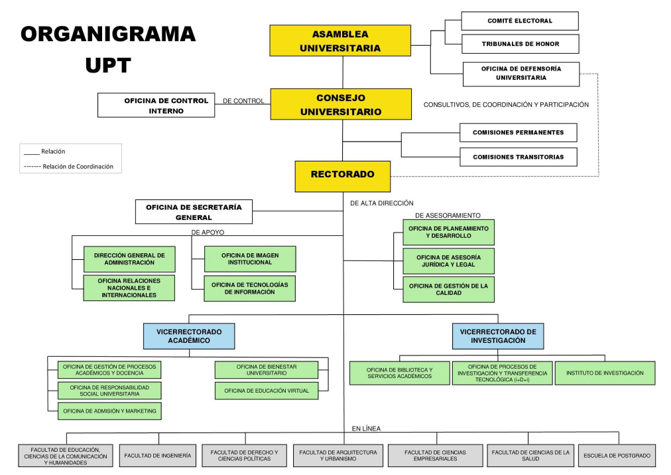

2. # Visionamiento de la empresa
3. ## Descripción del problema
   La Universidad Privada de Tacna (UPT), a través de la Escuela Profesional de Ingeniería de Sistemas (EPIS), no cuenta con un sistema automatizado para analizar el perfil profesional de sus egresados en LinkedIn. Actualmente, la recopilación de información sobre empleabilidad, sectores de trabajo y habilidades más demandadas se realiza de manera manual, lo que dificulta la obtención de datos precisos y actualizados.

   Esta falta de información estructurada impide a la EPIS-UPT evaluar con precisión la inserción laboral de sus egresados y adaptar su plan curricular a las necesidades del mercado.
4. ## Objetivos de Negocio
   Los principales objetivos de negocio son:

- Optimizar el seguimiento de egresados mediante un sistema centralizado de análisis de perfiles.
- Fortalecer la reputación de la EPIS con información sobre el éxito profesional de sus egresados.
- Mejorar la calidad educativa ajustando los planes de estudio según las tendencias del mercado laboral.
- Facilitar la conexión entre egresados y empleadores al identificar habilidades y competencias clave.
- Proporcionar reportes estadísticos para la toma de decisiones estratégicas dentro de la universidad.
1. ## Objetivos de Diseño
- Desarrollar un sistema que permita la carga, procesamiento y visualización de datos sobre los egresados.
- Implementar herramientas de análisis para procesar la información y generar reportes gráficos.
- Diseñar una interfaz intuitiva y accesible para administradores y usuarios interesados en la información.
- Garantizar la seguridad y privacidad de los datos recopilados.
1. ## Alcance del proyecto
   El sistema **incluirá**:

- Registrar y administrar información sobre los egresados.
- Recopilar datos de LinkedIn de manera manual.
- Generar reportes y gráficos estadísticos sobre empleabilidad y tendencias.
- Exportar informes en formatos como PDF y Excel.

`	`El sistema **no incluirá**:

- Integración directa con LinkedIn mediante APIs, debido a las restricciones de acceso.
- Contacto directo con los egresados para actualización de información.

1. ## Viabilidad del sistema
- Se utilizarán tecnologías accesibles y compatibles con los sistemas actuales de la UPT.
- Se cuenta con personal capacitado en desarrollo de software y análisis de datos.
- El desarrollo del sistema requiere una inversión inicial en software y servidores, pero reducirá costos a largo plazo.
- Se puede integrar con herramientas gratuitas o de bajo costo para minimizar gastos.
- Se respetarán las regulaciones de privacidad de datos y los términos de uso de LinkedIn.
- Solo se analizarán datos públicos, evitando problemas legales relacionados con la protección de datos personales.
1. ## Información obtenida del levantamiento de información
- **Información de datos sobre el proceso actual de seguimiento a egresados**\
  Actualmente, el seguimiento de egresados se realiza de manera manual a través de encuestas ocasionales o búsquedas individuales en LinkedIn. No existe un sistema centralizado ni una base de datos actualizada.
- **Información demográfica de los egresados**\
  Se recopilan datos básicos como nombre, año de egreso, especialidad y en algunos casos, país o ciudad de residencia actual. No siempre se obtiene información sobre cargos laborales, empresas o habilidades.
- **Información sobre la inserción laboral de los egresados**\
  Los egresados trabajan en diversos sectores como tecnología, educación, servicios y consultoría. Sin embargo, no se cuenta con reportes estadísticos consolidados para medir áreas específicas de inserción o tendencias laborales.
- **Información sobre la satisfacción de los egresados con su formación académica**\
  Existe la necesidad de medir con mayor precisión el grado de satisfacción de los egresados respecto a la formación recibida en la EPIS-UPT y su aplicabilidad en el mercado laboral actual.
- **Información sobre los métodos de recopilación de datos actuales**\
  Las fuentes principales de información son encuestas enviadas por correo electrónico, llamadas telefónicas esporádicas y búsquedas manuales en redes sociales profesionales como LinkedIn.
- **Información sobre las herramientas tecnológicas disponibles**\
  Actualmente, se dispone de acceso a herramientas básicas como hojas de cálculo (Excel) para almacenar la información, pero no existe un sistema automatizado o especializado para análisis de datos de egresados.
- **Información sobre otras instituciones**\
  Algunas universidades cercanas ya han implementado sistemas de seguimiento de egresados utilizando plataformas propias o integradas con redes sociales, lo que les ha permitido mejorar su comunicación con los egresados y adaptar mejor sus programas académicos.
- **Información sobre beneficios esperados**\
  Se identificó que la implementación de un sistema automatizado de análisis permitiría obtener datos más confiables, mejorar la planificación académica, fortalecer la vinculación con el entorno laboral y elevar la imagen institucional de la universidad.

1. # Análisis de procesos

1) ## Diagrama del proceso actual - Diagrama de Actividades
   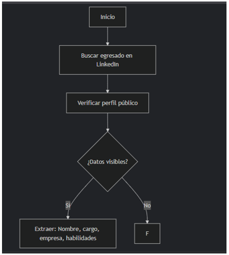

2) ## Diagrama del proceso propuesto - Diagrama de Actividades inicial
   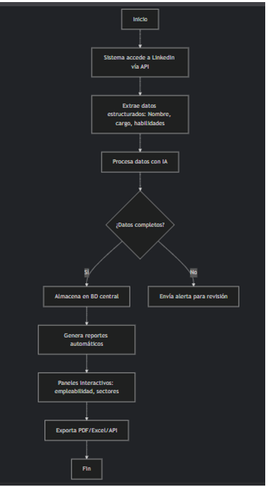

3. # Especificación de Requerimientos de Software
4) ## Cuadro de requerimientos funcionales inicial

|ID|Requerimiento F.|Descripción|
| :-: | :-: | :-: |
|RF-01|Registro de egresados|Permitir el registro manual de datos básicos de egresados (nombre, carrera, año de egreso, ciudad, empresa actual).|
|RF-02|Edición de información|Permitir modificar la información registrada de un egresado.|
|RF-03|Eliminación de egresados|Permitir eliminar registros de egresados incorrectos o duplicados.|
|RF-04|Búsqueda de egresados|Permitir buscar egresados por nombre, empresa o ciudad.|
|RF-05|Carga de datos desde archivos|Permitir importar registros de egresados desde archivos Excel (.xlsx) o CSV.|
|RF-06|Extracción manual de información de LinkedIn|Permitir registrar información adicional observada en perfiles de LinkedIn, como cargo actual y habilidades.|
|RF-07|Generación de reportes|Permitir generar reportes estadísticos sobre empleabilidad, sectores de trabajo y habilidades destacadas.|
|RF-08|Visualización gráfica de datos|Mostrar gráficos de sectores laborales, cargos más comunes y niveles de estudios de los egresados.|
|RF-09|Exportación de reportes|Permitir exportar reportes en formato PDF y Excel.|
|RF-10|Gestión de usuarios|Permitir el acceso al sistema mediante credenciales de usuarios administradores.|
|RF-11|Registro de actualizaciones|Llevar un historial de cambios realizados en los datos de los egresados.|
|RF-12|Filtrado avanzado de egresados|Permitir filtrar egresados por criterios como año de egreso, ciudad, empresa, o sector económico.|
|RF-13|Seguridad de datos|Proteger el acceso a la información mediante roles y permisos.|
|RF-14|Respaldo de la base de datos|Permitir realizar copias de seguridad periódicas de la información.|
|RF-15|Visualización de tendencias en el tiempo|Mostrar la evolución de la empleabilidad y sectores laborales por promociones de egreso.|

1) ## Cuadro de requerimientos no funcionales

|ID|Requerimiento No F.|Descripción|
| :-: | :-: | :-: |
|RNF-01|Accesibilidad |El sistema debe ser accesible desde navegadores web comunes como Chrome, Firefox o Edge.|
|RNF-02|Usabilidad|La interfaz debe ser intuitiva y fácil de usar para administradores no especializados en tecnología.|
|RNF-03|Seguridad |La información debe estar protegida mediante autenticación de usuarios y protocolos de cifrado.|
|RNF-04|Rendimiento|El sistema debe permitir consultas y generación de reportes en menos de 5 segundos para bases de hasta 10,000 egresados.|
|RNF-05|Compatibilidad|El sistema debe ser compatible con archivos de entrada en formato Excel (.xlsx) y CSV.|

1) ## Cuadro de requerimientos funcionales final

|ID|Requerimiento F.|Descripción|
| :-: | :-: | :-: |
|RF-01|Registro de egresados|Permitir el registro manual de datos básicos de egresados (nombre, carrera, año de egreso, ciudad, empresa actual).|
|RF-02|Edición de información|Permitir modificar la información registrada de un egresado.|
|RF-03|Eliminación de egresados|Permitir eliminar registros de egresados incorrectos o duplicados.|
|RF-04|Búsqueda de egresados|Permitir buscar egresados por nombre, empresa o ciudad.|
|RF-05|Carga de datos desde archivos|Permitir importar registros de egresados desde archivos Excel (.xlsx) o CSV.|
|RF-06|Extracción manual de información de LinkedIn|Permitir registrar información adicional observada en perfiles de LinkedIn, como cargo actual y habilidades.|
|RF-07|Generación de reportes|Permitir generar reportes estadísticos sobre empleabilidad, sectores de trabajo y habilidades destacadas.|
|RF-08|Visualización gráfica de datos|Mostrar gráficos de sectores laborales, cargos más comunes y niveles de estudios de los egresados.|
|RF-09|Exportación de reportes|Permitir exportar reportes en formato PDF y Excel.|
|RF-10|Gestión de usuarios|Permitir el acceso al sistema mediante credenciales de usuarios administradores.|
|RF-11|Registro de actualizaciones|Llevar un historial de cambios realizados en los datos de los egresados.|
|RF-12|Filtrado avanzado de egresados|Permitir filtrar egresados por criterios como año de egreso, ciudad, empresa, o sector económico.|
|RF-13|Seguridad de datos|Proteger el acceso a la información mediante roles y permisos.|
|RF-14|Respaldo de la base de datos|Permitir realizar copias de seguridad periódicas de la información.|
|RF-15|Visualización de tendencias en el tiempo|Mostrar la evolución de la empleabilidad y sectores laborales por promociones de egreso.|

1) ## Reglas de Negocio

||Regla de Negocio|Descripción|
| :- | :-: | :-: |
|1|Validación de Datos Públicos|Solo se permitirá registrar información extraída de perfiles públicos en LinkedIn, respetando las políticas de privacidad de la plataforma.|
|2|Horario de Actualización de Datos|El sistema podrá recibir nuevas cargas de datos o actualizaciones únicamente en horarios programados para evitar inconsistencias (por ejemplo, fuera del horario de clases o atención administrativa).|
|3|Verificación de Datos de Egresados|Todo dato ingresado manualmente debe ser verificado por un administrador antes de formar parte de los reportes oficiales.|
|4|Restricción de Modificación de Datos|Solo usuarios con rol de Administrador tendrán permisos para modificar o eliminar información de los egresados registrados.|
|5|Formato Estándar de Reportes|Los reportes generados (empleabilidad, habilidades, sectores) deberán seguir un formato estándar establecido por la EPIS para su análisis y publicación.|

#
#
#
#

1. # Fase de desarrollo

1. ## Perfil de Usuario:
   Este perfil corresponde a los usuarios (docentes, investigadores o responsables académicos) que utilizarán el sistema para consultar y analizar la información de los egresados.

Este perfil tendrá el acceso o permisos de:

- Consultar información de los egresados registrada en el sistema.
- Generar reportes estadísticos de empleabilidad, sectores laborales y habilidades.
- Visualizar gráficos y tendencias de inserción laboral.
- Exportar informes en formatos PDF y Excel.
- Acceder a datos históricos de actualizaciones de egresados.

  Perfil de Administrador:

  Este perfil corresponde al encargado designado por la EPIS (por ejemplo, personal de coordinación académica o de seguimiento de egresados) que gestiona y mantiene el sistema.

Este perfil tendrá el acceso o permisos de:

- Acceso completo al sistema.
- Registrar, actualizar y eliminar información de egresados.
- Gestionar usuarios investigadores (creación y asignación de permisos).
- Cargar lotes de datos extraídos manualmente de LinkedIn.
- Configurar parámetros del sistema como campos de búsqueda o filtros de análisis.
- Generar reportes generales y personalizados.
- Controlar la seguridad del sistema y realizar mantenimiento preventivo.
- Supervisar el cumplimiento de las políticas de privacidad de los datos.

1. ## Modelo Conceptual
1) ### Diagrama de Paquetes
   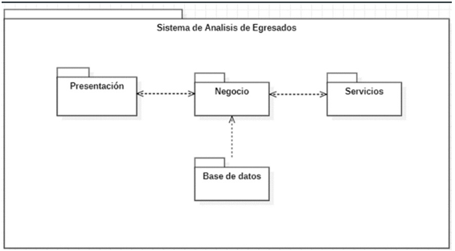

2) ### Diagrama de Casos de Uso

1) ### Escenarios de caso de uso (Narrativa)
**RF-001-Registro de egresados**

|`                                    `**Registro de egresados**    ||
| :- | :- |
|**Tipo**|**Obligatorio**|
|**Autor(es)**|**Brian Danilo Chite Quispe**|
|**Actores**|Egresado, Sistema|
|**Descripción**|Permitir que los egresados se registren en el sistema proporcionando información personal, académica y de contacto.|
|**Precondiciones**|El egresado debe tener acceso a internet y contar con la información requerida para el registro.|
|`                                     `**Narrativa de cada de uso**||
|` `**Acción del actor**|**Respuesta del sistema**|
|1\. El egresado ingresa al módulo de registro de egresados.|2\. El sistema muestra el formulario de registro.|
|3\. El egresado completa el formulario con su información (nombre, DNI, carrera, año de egreso, correo electrónico, número de teléfono).|4\. El sistema valida que todos los campos obligatorios estén llenos y que los datos tengan el formato correcto.|
|5\. El egresado envía el formulario de registro.|6\. El sistema guarda la información en la base de datos y muestra un mensaje de confirmación de registro exitoso.|

**RF-002-Edición de información**

|`                                    `**Edición de información**||
| :- | :- |
|**Tipo**|**Obligatorio**|
|**Autor(es)**|**Brian Danilo Chite Quispe**|
|**Actores**|Egresado, Administrador, Sistema|
|**Descripción**|Permitir a los egresados o administradores editar la información previamente registrada, como datos personales, académicos y de contacto.|
|**Precondiciones**|
El egresado debe estar registrado en el sistema y haber iniciado sesión correctamente. El administrador debe tener los permisos necesarios para editar la información de los egresados.

|
|`                                     `**Narrativa de cada de uso**||
|` `**Acción del actor**|`   `**Respuesta del sistema**|
|1\. El egresado o administrador selecciona la opción para editar la información.|2\. El sistema muestra el formulario con la información actual del egresado.|
|3\. El actor modifica los campos requeridos (nombre, dirección, teléfono, correo electrónico, etc.).|4\. El sistema valida los cambios realizados y verifica que los campos estén correctamente completados.|
|5\. El actor envía los cambios.|6\. El sistema guarda la nueva información en la base de datos y muestra un mensaje de confirmación de los cambios realizados con éxito.|

**RF-003-Eliminación de egresados**

|`                                `**Eliminación de egresados**||
| :- | :- |
|**Tipo**|**Obligatorio**|
|**Autor(es)**|**Brian Danilo Chite Quispe**|
|**Actores**|Administrador, Sistema|
|**Descripción**|Permitir a un administrador eliminar el registro de un egresado del sistema. La eliminación implica que el egresado ya no estará disponible en la base de datos del sistema.|
|**Precondiciones**|
El administrador debe estar autenticado y tener permisos para eliminar egresados del sistema. El egresado debe estar registrado en la base de datos.

|
|`                                     `**Narrativa de cada de uso**||
|`                   `**Acción del actor**|`                            `**Respuesta del sistema**|
|1\. El administrador selecciona la opción para eliminar un egresado.|2\. El sistema muestra una lista de egresados registrados o permite la búsqueda por identificación o nombre.|
|3\. El administrador selecciona el egresado a eliminar y confirma la acción.|4\. El sistema muestra una ventana de confirmación para asegurarse de que el administrador desea eliminar el registro.|
|5\. El administrador confirma la eliminación.|6\. El sistema elimina el registro del egresado de la base de datos y muestra un mensaje de confirmación de la eliminación exitosa.|

**RF-004-Búsqueda de egresados**

|`                                `**Búsqueda de egresados**||
| :- | :- |
|**Tipo**|**Obligatorio**|
|**Autor(es)**|**Brian Danilo Chite Quispe**|
|**Actores**|Usuario Registrado, Sistema|
|**Descripción**|Permitir a los usuarios registrados realizar una búsqueda de egresados en el sistema utilizando diversos criterios, como nombre, ID, o especialidad.|
|**Precondiciones**|
El usuario debe estar registrado y autenticado en el sistema. El sistema debe tener registros de egresados para realizar la búsqueda.

|
|`                                     `**Narrativa de cada de uso**||
|`                   `**Acción del actor**|`                            `**Respuesta del sistema**|
|1\. El usuario registrado accede a la funcionalidad de búsqueda de egresados en el sistema.|2\. El sistema presenta una interfaz para ingresar criterios de búsqueda, como nombre, ID o especialidad.|
|3\. El usuario ingresa los criterios de búsqueda (por ejemplo, nombre o especialidad) y realiza la búsqueda.|4\. El sistema procesa los criterios de búsqueda y muestra una lista de egresados que coinciden con los criterios proporcionados.|
|5\. El usuario puede hacer clic sobre un egresado de la lista para ver más detalles.|6\. El sistema muestra la información detallada del egresado seleccionado, como su nombre completo, especialidad, año de egreso, entre otros.|

**RF-005-Carga de datos desde archivos**

|`                                                             `**Carga de datos desde archivos**||
| :- | :- |
|**Tipo**|**Obligatorio**|
|**Autor(es)**|**Brian Danilo Chite Quispe**|
|**Actores**|Usuario Registrado, Sistema|
|**Descripción**|Permitir a los usuarios registrados cargar datos de egresados a través de archivos (por ejemplo, archivos CSV o Excel) para actualizar la base de datos del sistema.|
|**Precondiciones**|
El usuario debe estar autenticado en el sistema y debe tener acceso al módulo de carga de datos. El sistema debe permitir la carga de archivos en un formato predefinido (CSV, Excel, etc.).

|
|`                                     `**Narrativa de cada de uso**||
|`                   `**Acción del actor**|`                            `**Respuesta del sistema**|
|1\. El usuario registrado accede a la funcionalidad de carga de datos desde archivos.|2\. El sistema presenta una interfaz para seleccionar y cargar el archivo que contiene los datos de egresados.|
|3\. El usuario selecciona el archivo desde su dispositivo y hace clic en "Cargar".|4\. El sistema valida el formato del archivo y los datos contenidos en él. Si el archivo es válido, el sistema procede a cargar los datos en la base de datos.|
|5\. Si la carga es exitosa, el sistema confirma la carga de los datos y actualiza la base de datos.|6\. El sistema muestra un mensaje de éxito y actualiza los registros de egresados con los datos del archivo cargado.|

**RF-006-Extracción manual de información de LinkedIn**

|`                    `**Extracción manual de información de LinkedIn**||
| :- | :- |
|**Tipo**|**Obligatorio**|
|**Autor(es)**|**Brian Danilo Chite Quispe**|
|**Actores**|Usuario Registrado, Sistema|
|**Descripción**|Permite a los usuarios registrados extraer manualmente información de perfiles de LinkedIn relacionados con los egresados. El usuario debe ingresar datos como nombre, cargo, empresa, entre otros, desde LinkedIn para actualizar el sistema con esta información.|
|**Precondiciones**|
El usuario debe estar autenticado en el sistema. El usuario debe tener acceso a LinkedIn y permisos para ver la información relevante del perfil de un egresado.

|
|`                                     `**Narrativa de cada de uso**||
|`                   `**Acción del actor**|`                            `**Respuesta del sistema**|
|1\. El usuario accede a la funcionalidad de extracción manual de información de LinkedIn desde el sistema.|2\. El sistema presenta un formulario donde el usuario puede ingresar manualmente la información obtenida de LinkedIn (nombre, cargo, empresa, etc.).|
|3\. El usuario ingresa los datos del egresado o hace una búsqueda manual en LinkedIn para completar el formulario.|4\. El sistema valida la entrada de datos y verifica que los campos obligatorios se hayan completado correctamente.|
|5\. El usuario envía la información completada.|6\. El sistema procesa la información y actualiza la base de datos con los nuevos datos del egresado. El sistema confirma que la información ha sido registrada correctamente.|

**RF-007-Generación de reportes**

|`                                  `**Generación de reportes**||
| :- | :- |
|**Tipo**|**Obligatorio**|
|**Autor(es)**|**Brian Danilo Chite Quispe**|
|**Actores**|Usuario Registrado, Sistema|
|**Descripción**|Este caso de uso permite a los usuarios registrados generar reportes sobre los egresados, con la opción de personalizar el tipo de reporte (por ejemplo, por año de egreso, carrera, etc.) y el formato de salida (PDF, Excel).|
|**Precondiciones**|
El usuario debe estar autenticado en el sistema. El sistema debe contar con los datos de los egresados que permiten generar el reporte.

|
|`                                     `**Narrativa de cada de uso**||
|`                   `**Acción del actor**|`                            `**Respuesta del sistema**|
|1\. El usuario accede a la sección de generación de reportes en el sistema.|2\. El sistema presenta una interfaz con opciones para seleccionar el tipo de reporte y el formato de salida (PDF, Excel).|
|3\. El usuario selecciona los filtros del reporte (por ejemplo, año de egreso, carrera, etc.) y el formato deseado.|4\. El sistema valida la selección de filtros y formato, y confirma que la solicitud está lista para generar el reporte.|
|5\. El usuario hace clic en el botón para generar el reporte.|6\. El sistema genera el reporte según los parámetros seleccionados. El sistema crea el archivo en el formato elegido y lo presenta para ser descargado o enviado por correo electrónico al usuario.|

**RF-008-Visualización gráfica de datos**

|`                            `**Visualización gráfica de datos**||
| :- | :- |
|**Tipo**|**Obligatorio**|
|**Autor(es)**|**Brian Danilo Chite Quispe**|
|**Actores**|Usuario Registrado, Sistema|
|**Descripción**|Este caso de uso permite a los usuarios registrados visualizar gráficamente datos sobre los egresados, como distribución por carrera, años de egreso, o cualquier otra métrica relevante, con opciones para personalizar las gráficas (barras, líneas, sectores, etc.).|
|**Precondiciones**|
El usuario debe estar autenticado en el sistema. Los datos sobre los egresados deben estar disponibles y almacenados en el sistema.

|
|`                                     `**Narrativa de cada de uso**||
|`                   `**Acción del actor**|`                            `**Respuesta del sistema**|
|1\. El usuario accede a la sección de visualización gráfica de datos.|2\. El sistema muestra un conjunto de opciones para elegir qué tipo de visualización se desea (por ejemplo, gráfico de barras, gráfico de líneas, gráfico de sectores) y qué datos se van a graficar (por ejemplo, distribución por carrera, por año de egreso).|
|3\. El usuario selecciona los parámetros de visualización, como el tipo de gráfico y los datos que desea mostrar.|4\. El sistema valida la selección y muestra una vista preliminar de la gráfica basada en los filtros seleccionados.|
|5\. El usuario hace clic en "Generar gráfica".|6\. El sistema genera la gráfica solicitada y la presenta en la interfaz del usuario. El gráfico es interactivo y el usuario puede explorar diferentes elementos (por ejemplo, al pasar el cursor sobre una barra o sección de la gráfica, se muestran detalles).|

**RF-009-Exportación de reportes**

|`                                     `**Exportación de reportes**||
| :- | :- |
|**Tipo**|**Obligatorio**|
|**Autor(es)**|**Brian Danilo Chite Quispe**|
|**Actores**|Usuario Registrado, Sistema|
|**Descripción**|Este caso de uso permite a los usuarios registrados exportar los reportes generados por el sistema en diferentes formatos (como PDF, Excel, CSV, etc.) para su almacenamiento o distribución externa.|
|**Precondiciones**|
El usuario debe estar autenticado en el sistema. El reporte a exportar debe haber sido generado previamente.

|
|`                                     `**Narrativa de cada de uso**||
|`                   `**Acción del actor**|`                            `**Respuesta del sistema**|
|1\. El usuario accede a la opción de exportación de reportes.|2\. El sistema muestra una lista de los reportes disponibles para exportar, junto con las opciones de formato (PDF, Excel, CSV, etc.).|
|3\. El usuario selecciona el reporte que desea exportar y el formato de salida.|4\. El sistema valida la selección y prepara el archivo para la exportación en el formato elegido.|
|5\. El usuario hace clic en "Exportar" o un botón similar.|6\. El sistema genera el archivo en el formato seleccionado y proporciona un enlace de descarga o lo envía al correo electrónico del usuario si así se ha configurado.|

**RF-010-Gestión de usuarios**

|`                                  `**Gestión de usuarios**||
| :- | :- |
|**Tipo**|**Obligatorio**|
|**Autor(es)**|**Brian Danilo Chite Quispe**|
|**Actores**|Administrador, Sistema|
|**Descripción**|Este caso de uso permite a los administradores gestionar los usuarios del sistema, lo que incluye la creación, modificación, eliminación y visualización de perfiles de usuario.|
|**Precondiciones**|
El administrador debe estar autenticado en el sistema. El usuario debe existir en la base de datos para modificar o eliminar su perfil.

|
|`                                     `**Narrativa de cada de uso**||
|`                   `**Acción del actor**|`                            `**Respuesta del sistema**|
|1\. El administrador accede a la sección de "Gestión de usuarios" desde el panel de administración.|2\. El sistema muestra una lista de todos los usuarios registrados, con opciones para agregar, editar o eliminar usuarios.|
|3\. El administrador selecciona la opción para agregar un nuevo usuario.|4\. El sistema muestra un formulario donde se deben ingresar los datos del nuevo usuario (nombre, correo electrónico, rol, etc.).|
|5\. El administrador completa el formulario y envía la solicitud.|6\. El sistema valida los datos ingresados y, si todo es correcto, agrega al usuario a la base de datos y muestra un mensaje de confirmación.|
|7\. El administrador selecciona un usuario de la lista para editar su información.|8\. El sistema muestra los detalles del usuario seleccionado, permitiendo su modificación (como nombre, correo, rol, etc.).|
|9\. El administrador realiza las modificaciones y guarda los cambios.|10\. El sistema valida los cambios y actualiza la información del usuario en la base de datos, mostrando un mensaje de confirmación.|
|11\. El administrador selecciona un usuario para eliminarlo.|12\. El sistema solicita una confirmación para eliminar al usuario y, si el administrador confirma, elimina al usuario de la base de datos.|
|13\. Si el administrador intenta eliminar un usuario con tareas o datos importantes asociados, el sistema muestra una advertencia.|14\. El sistema informa al administrador que no se puede eliminar al usuario debido a dependencias y sugiere alternativas (como reasignar tareas antes de la eliminación).|

**RF-011-Registro de actualizaciones**

|`                                     `**Registro de actualizaciones**||
| :- | :- |
|**Tipo**|**Obligatorio**|
|**Autor(es)**|**Brian Danilo Chite Quispe**|
|**Actores**|Usuario Registrado, Sistema|
|**Descripción**|Este caso de uso permite registrar todas las actualizaciones realizadas en el sistema, tanto por los usuarios como por el sistema mismo, con el fin de mantener un historial de cambios para auditoría y control.|
|**Precondiciones**|
El usuario debe tener los permisos necesarios para realizar actualizaciones en el sistema. El sistema debe estar configurado para registrar todas las acciones de actualización.

|
|`                                     `**Narrativa de cada de uso**||
|`                   `**Acción del actor**|`                            `**Respuesta del sistema**|
|1\. El usuario realiza una actualización en el sistema (por ejemplo, modificar datos de un egresado, editar información de un usuario, etc.).|2\. El sistema guarda un registro detallado de la actualización, incluyendo la acción realizada, el usuario que la ejecutó, la fecha y hora, y los datos modificados.|
|3\. El sistema permite ver el historial de actualizaciones realizadas previamente.|4\. El sistema muestra una lista de todas las actualizaciones previas, con opciones de filtrado (por fecha, usuario, tipo de acción, etc.).|
|5\. El usuario consulta una actualización específica.|6\. El sistema muestra los detalles de la actualización seleccionada, incluyendo los cambios realizados y la información relevante (anterior y nueva).|
|7\. El sistema alerta al usuario si la actualización no puede ser registrada (por ejemplo, debido a problemas de permisos o de base de datos).|8\. El sistema muestra un mensaje de error y sugiere una posible solución (por ejemplo, verificar los permisos del usuario o la conexión a la base de datos).|
|9\. El administrador puede eliminar registros antiguos de actualizaciones, si es necesario.|10\. El sistema solicita confirmación antes de eliminar el registro, y luego lo elimina de la base de datos, actualizando el historial.|

**RF-012-Filtrado avanzado de egresados**

|`                               `**Filtrado avanzado de egresados**||
| :- | :- |
|**Tipo**|**Obligatorio**|
|**Autor(es)**|**Brian Danilo Chite Quispe**|
|**Actores**|Usuario Registrado, Sistema|
|**Descripción**|Este caso de uso permite a los usuarios realizar búsquedas avanzadas sobre los egresados, filtrando la información según diferentes criterios específicos, como carrera, año de egreso, ubicación, entre otros. El sistema facilita la búsqueda de egresados específicos mediante un conjunto de filtros detallados.|
|**Precondiciones**|
El usuario debe estar registrado y tener acceso al sistema. El sistema debe tener almacenados los datos de los egresados, y debe ofrecer opciones de filtrado configurables.

|
|`                                     `**Narrativa de cada de uso**||
|`                   `**Acción del actor**|`                            `**Respuesta del sistema**|
|1\. El usuario selecciona la opción de filtrado avanzado.|2\. El sistema muestra una interfaz con múltiples opciones de filtro, como carrera, año de egreso, ubicación, etc.|
|3\. El usuario establece criterios de filtrado (por ejemplo, seleccionando "Ingeniería" para carrera y "2020" para año de egreso).|4\. El sistema procesa los filtros seleccionados y genera una lista de egresados que coinciden con los criterios establecidos.|
|5\. El usuario solicita realizar el filtrado.|6\. El sistema muestra una lista de egresados que cumplen con los filtros aplicados, presentando los resultados de manera clara y organizada.|
|7\. El usuario puede ajustar los filtros (agregar o quitar criterios).|8\. El sistema vuelve a procesar los datos con los nuevos criterios y actualiza la lista de resultados mostrados.|
|9\. El usuario visualiza los detalles de un egresado seleccionado.|10\. El sistema muestra la información detallada del egresado seleccionado, como su nombre, contacto, carrera, etc.|
|11\. El usuario desea guardar los resultados de la búsqueda filtrada.|12\. El sistema permite al usuario exportar los resultados a un archivo (por ejemplo, CSV o PDF)|
|13\. El sistema no encuentra egresados que coincidan con los filtros aplicados.|14\. El sistema muestra un mensaje indicando que no se han encontrado resultados y sugiere verificar los criterios de búsqueda.|

**RF-013-Seguridad de datos**

|`                                            `**Seguridad de datos**||
| :- | :- |
|**Tipo**|**Obligatorio**|
|**Autor(es)**|**Brian Danilo Chite Quispe**|
|**Actores**|Administrador, Sistema|
|**Descripción**|Este caso de uso garantiza la protección de los datos almacenados en el sistema, implementando medidas de seguridad como la encriptación, control de acceso, autenticación y autorización para asegurar que solo usuarios autorizados puedan acceder a los datos confidenciales.|
|**Precondiciones**|
El sistema debe estar configurado para permitir autenticación de usuarios y encriptación de datos sensibles. El usuario debe estar autenticado y contar con los privilegios necesarios para acceder o modificar datos sensibles.

|
|`                                     `**Narrativa de cada de uso**||
|`                   `**Acción del actor**|`                            `**Respuesta del sistema**|
|1\. El usuario intenta acceder a la plataforma.|2\. El sistema solicita credenciales de inicio de sesión, como usuario y contraseña, para validar la identidad del actor.|
|3\. El usuario ingresa sus credenciales.|4\. El sistema verifica la autenticidad de las credenciales contra la base de datos de usuarios. Si las credenciales son correctas, el sistema permite el acceso; si son incorrectas, muestra un mensaje de error.|
|5\. El administrador configura permisos de acceso para diferentes usuarios.|6\. El sistema actualiza los permisos y roles de los usuarios según las configuraciones del administrador, asegurando que solo los usuarios autorizados tengan acceso a información sensible.|
|7\. El usuario intenta acceder a un dato sensible sin los permisos adecuados.|8\. El sistema muestra un mensaje de error y bloquea el acceso a la información solicitada, garantizando que el usuario no autorizado no pueda ver o modificar datos restringidos.|
|9\. El sistema encripta los datos sensibles antes de almacenarlos.|10\. El sistema aplica algoritmos de encriptación para proteger datos como contraseñas, información personal y cualquier dato sensible, asegurando que, incluso en caso de brecha de seguridad, los datos no puedan ser leídos fácilmente.|
|11\. El sistema realiza auditorías de acceso a datos.|12\. El sistema mantiene un registro de auditoría detallado de todas las interacciones con los datos sensibles, como accesos y modificaciones, que pueden ser consultados por el administrador para verificar cualquier intento no autorizado de acceso.|
|13\. Un usuario autorizado solicita realizar una exportación de datos sensibles.|14\. El sistema solicita una segunda capa de autenticación (por ejemplo, verificación en dos pasos) antes de permitir la exportación de los datos, asegurando que la solicitud sea legítima.|
|15\. El sistema detecta un intento de acceso no autorizado a los datos.|16\. El sistema bloquea automáticamente el intento de acceso, genera un registro de alerta y notifica a los administradores sobre el incidente para una pronta investigación.|

**RF-014-Respaldo de la base de datos**

|`                                 `**Respaldo de la base de datos**||
| :- | :- |
|**Tipo**|**Obligatorio**|
|**Autor(es)**|**Brian Danilo Chite Quispe**|
|**Actores**|Administrador, Sistema|
|**Descripción**|Este caso de uso permite realizar un respaldo completo de la base de datos para asegurar que toda la información almacenada en el sistema esté protegida ante posibles fallos del sistema, pérdida de datos o ataques.|
|**Precondiciones**|
El sistema debe estar operando correctamente y el administrador debe tener acceso al módulo de administración de la base de datos para realizar el respaldo. Además, se debe contar con suficiente espacio en el almacenamiento para guardar la copia de seguridad.

|
|`                                     `**Narrativa de cada de uso**||
|`                   `**Acción del actor**|`                            `**Respuesta del sistema**|
|1\. El administrador accede al módulo de administración del sistema.|2\. El sistema muestra una opción para realizar el respaldo de la base de datos.|
|3\. El administrador selecciona la opción de "Realizar respaldo".|4\. El sistema solicita confirmación para iniciar el proceso de respaldo.|
|5\. El administrador confirma que desea realizar el respaldo.|6\. El sistema comienza a crear una copia de seguridad de la base de datos y muestra una barra de progreso.|
|7\. El sistema crea un respaldo de toda la base de datos, incluyendo tablas y registros.|8\. El sistema guarda el respaldo en un archivo comprimido o en el almacenamiento designado y muestra un mensaje de éxito.|
|9\. El administrador desea verificar la ubicación del archivo de respaldo.|10\. El sistema muestra la ubicación exacta donde se guardó el archivo de respaldo o proporciona un enlace para acceder a él.|
|11\. El administrador intenta realizar un respaldo mientras otro proceso de base de datos está en ejecución.|12\. El sistema muestra una advertencia indicando que el respaldo no puede realizarse durante la ejecución de otros procesos y sugiere intentarlo nuevamente después de finalizar los otros procesos.|
|13\. El administrador elige la opción de programar respaldos automáticos.|14\. El sistema solicita la configuración de la frecuencia y la hora para los respaldos automáticos, y luego guarda esta configuración.|
|15\. El sistema detecta que el espacio de almacenamiento disponible es insuficiente para realizar el respaldo.|16\. El sistema muestra un mensaje de advertencia sobre la falta de espacio y sugiere liberar espacio o utilizar otro almacenamiento antes de continuar.|
|17\. El administrador revisa el estado del respaldo programado.|18\. El sistema muestra el historial de respaldos realizados, incluyendo fechas, tamaños de archivos y el estado de éxito o error.|

**RF-015-** **Visualización de tendencias en el tiempo**

|`                          `**Visualización de tendencias en el tiempo**||
| :- | :- |
|**Tipo**|**Obligatorio**|
|**Autor(es)**|**Brian Danilo Chite Quispe**|
|**Actores**|Usuario Registrado, Sistema|
|**Descripción**|Este caso de uso permite al usuario visualizar gráficamente las tendencias de ciertos datos a lo largo del tiempo. Es útil para analizar comportamientos o patrones, como cambios en las ventas, el registro de egresados, o cualquier otra métrica relevante almacenada en el sistema.|
|**Precondiciones**|El usuario debe estar registrado y tener acceso a la funcionalidad de visualización de datos. Los datos a visualizar deben estar almacenados en la base de datos con las correspondientes fechas o periodos.|
|`                                     `**Narrativa de cada de uso**||
|`                   `**Acción del actor**|`                            `**Respuesta del sistema**|
|1\. El usuario accede al módulo de visualización de tendencias en el sistema.|2\. El sistema muestra opciones para seleccionar los datos a visualizar y el rango de tiempo (por ejemplo, días, meses, años).|
|3\. El usuario selecciona el tipo de dato que desea visualizar (por ejemplo, cantidad de egresados, ventas por mes, etc.).|4\. El sistema muestra un gráfico interactivo o una serie de gráficos basados en la selección del usuario.|
|5\. El usuario elige el periodo de tiempo para el cual desea visualizar las tendencias.|6\. El sistema actualiza el gráfico o la visualización de acuerdo al rango temporal elegido por el usuario.|
|7\. El usuario interactúa con el gráfico (por ejemplo, hace zoom, selecciona puntos específicos o compara datos).|8\. El sistema responde en tiempo real, actualizando la visualización con el nivel de detalle solicitado.|
|9\. El usuario quiere comparar las tendencias de diferentes periodos.|10\. El sistema permite al usuario superponer diferentes series de datos (por ejemplo, ventas de este año frente a las ventas del año pasado) y ajusta el gráfico en consecuencia.|
|11\. El usuario solicita ver el informe en formato descargable (por ejemplo, CSV o PDF).|12\. El sistema genera el archivo y proporciona un enlace para su descarga.|
|13\. El usuario desea ver una interpretación o análisis automático de las tendencias.|14\. El sistema proporciona un análisis de las tendencias detectadas, como crecimientos, caídas, o patrones estacionales, con recomendaciones automáticas basadas en los datos visualizados.|
|15\. El usuario intenta visualizar datos sin haber seleccionado ninguna métrica.|16\. El sistema muestra un mensaje indicando que debe seleccionar una métrica para proceder.|
|17\. El usuario hace clic en un punto específico de la gráfica para obtener más detalles sobre los datos de ese momento.|18\. El sistema muestra una ventana emergente con información detallada del dato en ese punto específico (por ejemplo, número exacto de ventas en ese mes o el número de egresados en ese año).|

1. ## Modelo Lógico

1) ### Análisis de objetos
RF-001-Registro de egresados

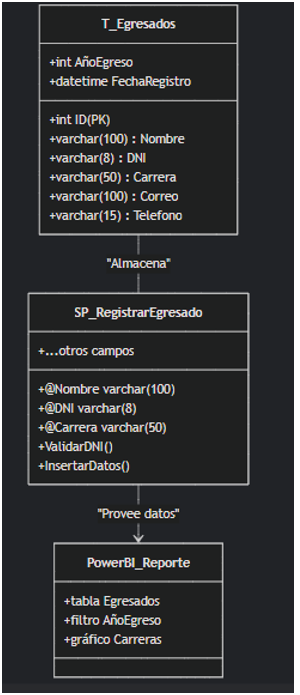

RF-002-Edición de información

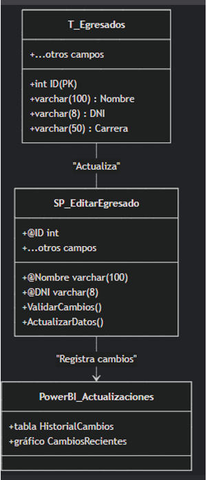

RF-003-Eliminación de egresados

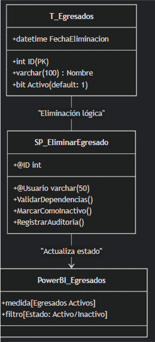

RF-004-Búsqueda de egresados

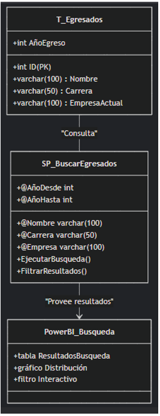

RF-005-Carga de datos desde archivos

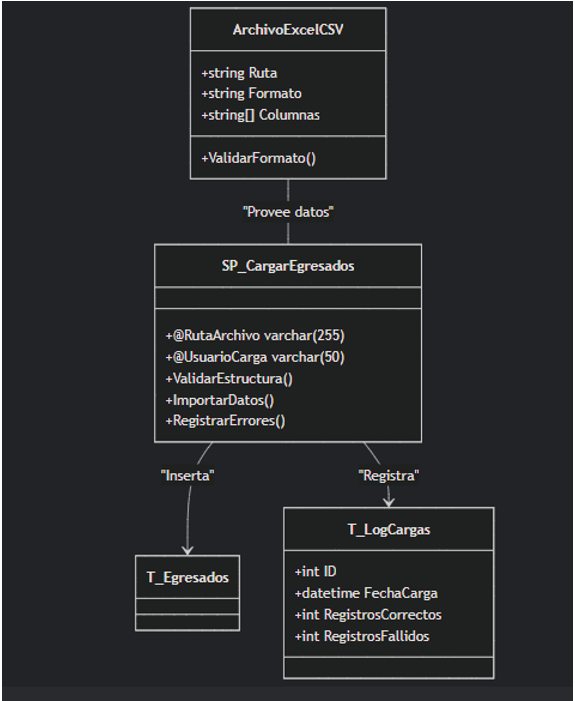

RF-006-Extracción manual de información de LinkedIn

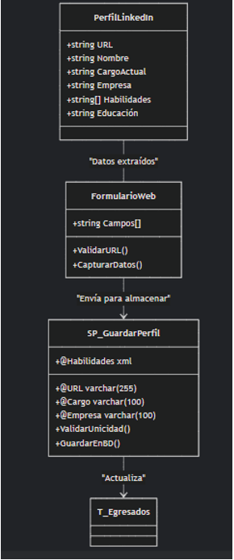

RF-007-Generación de reportes

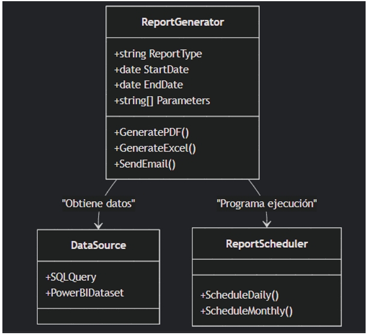

RF-008-Visualización gráfica de datos

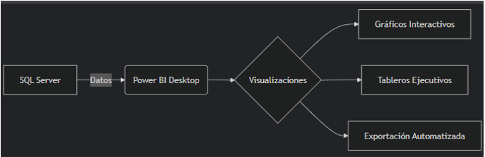

RF-009-Exportación de reportes

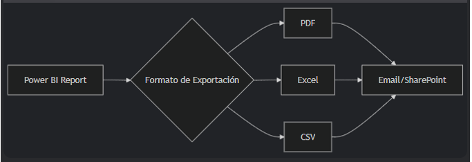

RF-010-Gestión de usuarios

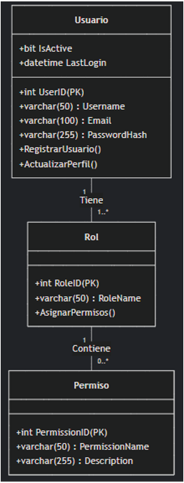

# CONCLUSIONES
- El Sistema de Análisis de Perfiles Profesionales para los egresados de la EPIS-UPT es una solución viable que optimiza el proceso de recolección y análisis de datos de los egresados. La automatización de este proceso permitirá obtener información precisa sobre la inserción laboral y las tendencias del mercado, lo que ayudará a la universidad a tomar decisiones estratégicas más informadas y ajustar sus programas académicos según las necesidades del entorno profesional. Con los recursos disponibles y la tecnología adecuada, la implementación del sistema traerá beneficios tangibles tanto a corto como a largo plazo.
- La viabilidad técnica y económica del sistema está confirmada, lo que asegura que la Universidad podrá implementar una herramienta eficiente que optimice el seguimiento de sus egresados y facilite la creación de reportes estadísticos. El sistema contribuirá al fortalecimiento de la reputación de la EPIS-UPT, mejorando su relación con los egresados y demostrando su compromiso con la calidad educativa.
 
# RECOMENDACIONES
- Se recomienda ofrecer capacitación periódica a los usuarios del sistema (administradores y responsables del análisis de datos) para asegurar que puedan gestionar correctamente la herramienta y resolver problemas menores de manera autónoma.
-  Dado que el sistema puede ser utilizado en diversos entornos, es fundamental que esté optimizado para dispositivos móviles. Esto permitirá que los usuarios puedan acceder a la información y generar reportes de manera eficiente desde smartphones o tablets.
- Es esencial reforzar las medidas de seguridad del sistema para proteger los datos personales y profesionales de los egresados. Esto incluye el cifrado de datos, autenticación de usuarios, y la implementación de copias de seguridad periódicas para garantizar la integridad y privacidad de la información.
- Se recomienda explorar la integración del sistema con plataformas de análisis de datos avanzadas, lo que permitirá realizar análisis más complejos, obtener reportes detallados y facilitar la toma de decisiones estratégicas para mejorar la oferta educativa de la EPIS-UPT.
#

