**UNIVERSIDAD PRIVADA DE TACNA**

**FACULTAD DE INGENIERIA**

**Escuela Profesional de Ingeniería de Sistemas**

**Proyecto**

**Sistema de análisis del Perfil Profesional de los Egresados de la EPIS de la UPT en LinkedIn**

Curso: *Inteligencia de negocios* 

Docente: Mag. Patrick Cuadros Quiroga* 

Integrantes:

- **Christian Dennis Hinojosa		(2019065161)**
- **Danilo Chite Quispe			(2021070015)**
- **Royser Villanueva Mamani	(2021071090)**

**Tacna – Perú**

***2025***

|CONTROL DE VERSIONES||||||
| :-: | :- | :- | :- | :- | :- |
|Versión|Hecha por|Revisada por|Aprobada por|Fecha|Motivo|
|1\.0|MPV|ELV|ARV|10/10/2020|Versión Original|

**Sistema de análisis del Perfil Profesional de los Egresados de la EPIS de la UPT en LinkedIn Documento de Arquitectura de Software**

**Versión *{1.0}***
**\

|CONTROL DE VERSIONES||||||
| :-: | :- | :- | :- | :- | :- |
|Versión|Hecha por|Revisada por|Aprobada por|Fecha|Motivo|
|1\.0|MPV|ELV|ARV|10/10/2020|Versión Original|

# **Índice General**
**1.** **INTRODUCCIÓN**

**1.1.**	**Propósito**

**1.2.**	**Alcance**

**1.3.**	**Definición, siglas y abreviaturas	4**

**1.4.**	**Organización del documento	5**

***2.***	***OBJETIVOS Y RESTRICCIONES ARQUITECTONICAS	5**

**2.1.1.**	**Requerimientos Funcionales**	

**2.1.2.**	**Requerimientos No Funcionales – Atributos de Calidad**

***3.***	**REPRESENTACIÓN DE LA ARQUITECTURA DEL SISTEMA**

**3.1.**	**Vista de Caso de uso	7**

**3.1.1.**	**Diagramas de Casos de uso**

**3.2.**	**Vista Lógica**

**3.2.1.**	**Diagrama de Subsistemas (paquetes)**	

**3.2.2.**	**Diagrama de Secuencia vista de diseño**

**3.2.3.	Diagrama de Colaboración vista de diseño**

**3.2.4.**	**Diagrama de Objetos**

**3.2.5.	Diagrama de Clases**

**3.2.6.**	**Diagrama de Base de datos (relacional o no relacional)**

**3.3.**	**Vista de Implementación (vista de desarrollo)**	

**3.3.1.**	**Diagrama de arquitectura software (paquetes)**

**3.3.2.**	**Diagrama de arquitectura del sistema (Diagrama de componentes)**

**3.4.**	**Vista de Despliegue (vista física)**	

**3.4.1.**	**Diagrama de despliegue**

***4.***	**ATRIBUTOS DE CALIDAD DEL SOFTWARE**	

**Escenario de Funcionalidad**

**Escenario de Usabilidad**

**Escenario de confiabilidad**	

**Escenario de rendimiento**

**Escenario de mantenibilidad**

1. INTRODUCCIÓN
   1. Propósito	

El propósito de este documento es proporcionar una visión general de la arquitectura del sistema “Sistema de Análisis de los Egresados de la EPIS de la UPT en LinkedIn” utilizando el enfoque del modelo de vistas 4+1 de Philippe Kruchten. Este enfoque permite visualizar y analizar el sistema desde cinco perspectivas clave: vista lógica, vista de desarrollo, vista de procesos, vista física y escenarios (casos de uso).

1. Alcance

Este documento de arquitectura se centrará principalmente en el desarrollo de la vista lógica del sistema “Sistema de Análisis de los Egresados de la EPIS de la UPT en LinkedIn”, proporcionando una representación clara de la estructura del software desde la perspectiva del diseño funcional. Esta vista mostrará los principales módulos del sistema, sus responsabilidades y la manera en que interactúan para satisfacer los requerimientos funcionales del proyecto.

Además, se presentarán aspectos esenciales de las demás vistas del modelo 4+1, como la vista de desarrollo (implementación) y la vista física (despliegue), con el fin de contextualizar el diseño general. Sin embargo, se omitirán vistas como la vista de procesos, debido a que el sistema no contempla procesos paralelos ni concurrencia compleja que amerite un análisis detallado de esta perspectiva.

1. Definición, siglas y abreviaturas

|Término / Sigla|Definición|
| :- | :- |
|API|Interfaz de Programación de Aplicaciones (Application Programming Interface). Conjunto de funciones y procedimientos que permiten la interacción entre sistemas de software.|
|Casos de uso|Técnica utilizada para identificar, clarificar y organizar los requisitos del sistema. Representa una interacción entre un usuario (actor) y el sistema.|
|DB|Base de Datos. Sistema que permite el almacenamiento y gestión de datos de manera estructurada.|
|EPIS|Escuela Profesional de Ingeniería de Sistemas (de la Universidad Privada de Tacna).|
|GUI|Interfaz Gráfica de Usuario (Graphical User Interface). Medio visual por el cual el usuario interactúa con el sistema.|
|LinkedIn|Red social orientada al uso empresarial, a los negocios y al empleo. Se utiliza para conectar a profesionales y empresas.|
|MVC|Modelo Vista Controlador. Patrón de arquitectura utilizado en el diseño de aplicaciones web y de escritorio.|
|SAD|Documento de Arquitectura de Software|
|Sistema|En el contexto del presente documento, se refiere al “Sistema de Análisis de los Egresados de la EPIS de la UPT en LinkedIn”.|
|UML|Lenguaje de Modelado Unificado (Unified Modeling Language). Estándar para el modelado de sistemas de software.|
|UPT|Universidad Privada de Tacna.|
|Vista Lógica|Vista del modelo 4+1 que describe la estructura del sistema desde la perspectiva de diseño orientado a objetos.|

1. Organización del documento

1. # **OBJETIVOS Y RESTRICCIONES ARQUITECTONICAS**
   1. Priorización de requerimientos

|ID|Descripción |Prioridad|
| :- | :- | :- |
|RF-01|Registro de egresados|Alta|
|RF-02|Edición de información|Alta|
|RF-03|Eliminación de egresados|Alta|
|RF-04|Búsqueda de egresados|Alta|
|RF-05|Carga de datos desde archivos|Media|
|RF-06|Extracción manual de información de LinkedIn|Media|
|RF-07|Generación de reportes|Alta|
|RF-08|Visualización grafica de datos|Alta|
|RF-09|Exportación de reportes|Media|
|RF-10|Gestión de usuarios|Alta|
|RF-11|Registro de actualizaciones|Media|
|RF-12|Filtrado avanzado de egresados|Media|
|RF-13|Seguridad de datos|Alta|
|RF-14|Respaldo de la base de datos|Alta|
|RF-15|Visualización de tendencias en el tiempo|Media|

1. ### Requerimientos Funcionales

   |ID|Descripción |Prioridad|
   | :- | :- | :- |
   |RF-01|Registro de egresados|Alta|
   |RF-02|Edición de información|Alta|
   |RF-03|Eliminación de egresados|Alta|
   |RF-04|Búsqueda de egresados|Alta|
   |RF-05|Carga de datos desde archivos|Media|
   |RF-06|Extracción manual de información de LinkedIn|Media|
   |RF-07|Generación de reportes|Alta|
   |RF-08|Visualización grafica de datos|Alta|
   |RF-09|Exportación de reportes|Media|
   |RF-10|Gestión de usuarios|Alta|
   |RF-11|Registro de actualizaciones|Media|
   |RF-12|Filtrado avanzado de egresados|Media|
   |RF-13|Seguridad de datos|Alta|
   |RF-14|Respaldo de la base de datos|Alta|
   |RF-15|Visualización de tendencias en el tiempo|Media|
   ###
1. ### Requerimientos No Funcionales – Atributos de Calidad

   |ID|Descripción |Prioridad|
   | :- | :- | :- |
   |RNF-01|Accesibilidad|Media|
   |RNF-02|Usabilidad|Alta|
   |RNF-03|Seguridad|Alta|
   |RNF-04|Rendimiento|Media|
   |RNF-05|Compatibilidad|Media|

1. Restricciones

El proyecto "Sistema de análisis de los egresados de la EPIS de la UPT en LinkedIn" presenta las siguientes restricciones:

- **Acceso a Información Limitada:** El acceso a datos completos de LinkedIn puede estar restringido por configuraciones de privacidad de los usuarios o limitaciones de la plataforma.
- **Fuentes de Información:** El sistema dependerá de la información proporcionada manualmente o extraída de forma limitada de perfiles públicos de LinkedIn, sin acceso a APIs oficiales de LinkedIn (por políticas de uso).
- **Alcance del Análisis:** El análisis se centrará exclusivamente en los egresados de la EPIS de la UPT, limitando el espectro de datos a una muestra específica.
- **Plazo de Entrega:** El sistema deberá estar implementado en un plazo previamente definido, lo que limita la posibilidad de incorporar funcionalidades adicionales fuera del alcance inicial.
- **Recursos Humanos:** El equipo de desarrollo es reducido, lo que restringe la cantidad de características que se pueden implementar simultáneamente.
- **Tecnologías Utilizadas:** El proyecto se desarrollará usando tecnologías específicas y alcanzables, como PHP, MySQL y librerías de gráficos (ej. Chart.js), limitando el uso de herramientas de análisis más complejas.
- **Seguridad y Privacidad:** Se deberán cumplir medidas de protección de datos personales, lo que implica restricciones en la forma de almacenar, procesar y mostrar información sensible.
- **Infraestructura:** El sistema será diseñado para ser alojado en un servidor de características moderadas, por lo que el consumo de recursos debe ser optimizado.
1. # **REPRESENTACIÓN DE LA ARQUITECTURA DEL SISTEMA**
   1. Vista de Caso de uso

|ID|Nombre|Descripción|
| - | - | - |
|CU-01|Registro de egresados|Permite al administrador registrar egresados manualmente o importar datos desde archivos.|
|CU-02|Edición y Eliminación de Egresados|Permite modificar o eliminar datos de egresados registrados.|
|CU-03|Búsqueda y Filtrado de egresados|Permite buscar egresados y aplicar filtros avanzados.|
|CU-04|Registro de datos de LinkedIn|Permite registrar información adicional observada en perfiles de LinkedIn.|
|CU-05|Generación de reportes y Gráficos |Permite generar reportes estadísticos y visualizar gráficos de los egresados.|
|CU-06|Exportación de Reportes|Permite exportar reportes en formatos PDF y Excel.|
|CU-07|Gestión de usuarios|Permite administrar el acceso de usuarios al sistema.|
|CU-08|Respaldo de bases de datos|Permite realizar copias de seguridad de la información.|
|CU-09|Registro de Actualizaciones|Permite registrar el historial de cambios en los datos de egresados.|

1. ### Diagramas de Casos de uso

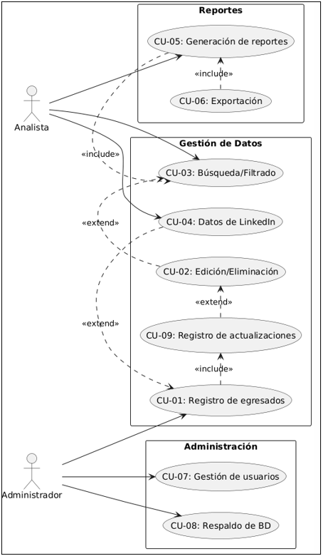

1. Vista Lógica
   1. ### Diagrama de Subsistemas (paquetes)
   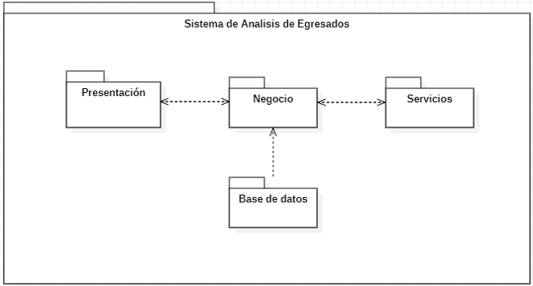

1. ### Diagrama de Secuencia (vista de diseño)

CU-01 Registro de Egresado
   
   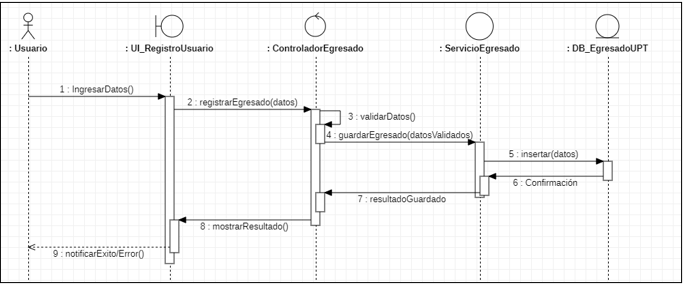

CU-02 Edición y eliminación de egresados

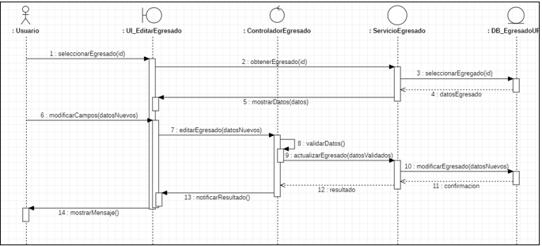

CU-03 Búsqueda y Filtrado de egresados

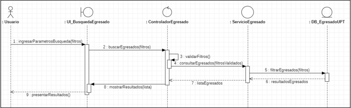

CU-04 Registro de datos de LinkedIn

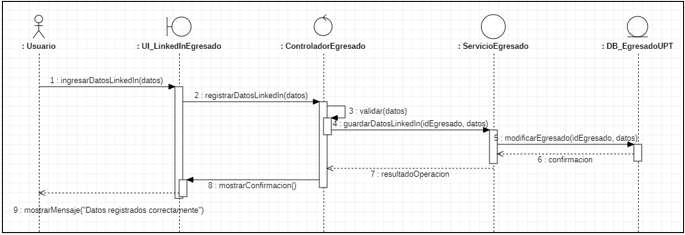

CU-05 Generación de reportes y Gráficos

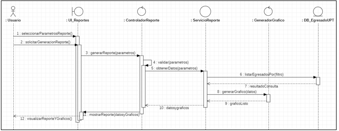

CU-06 Exportación de Reportes

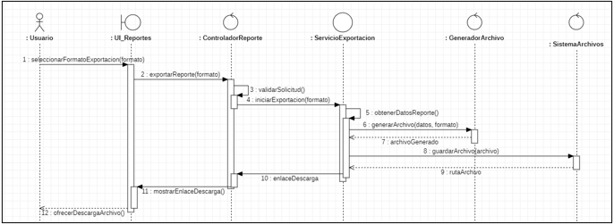

CU-07 Gestión de usuarios

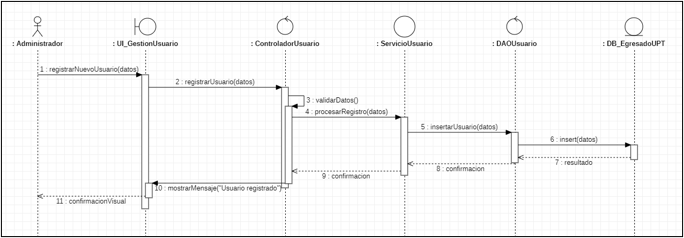

CU-08 Respaldo de bases de datos

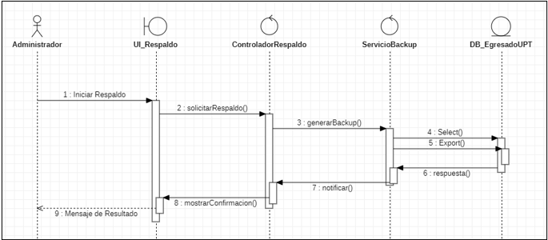

CU-09 Registro de Actualizaciones

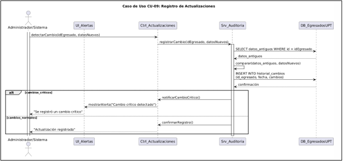
1. ### Diagrama de Colaboración (vista de diseño)

CU-01 Registro Egresados

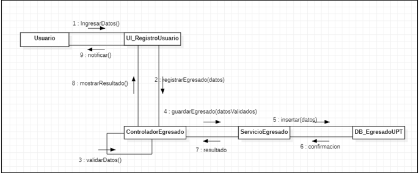

1. ### Diagrama de Objetos
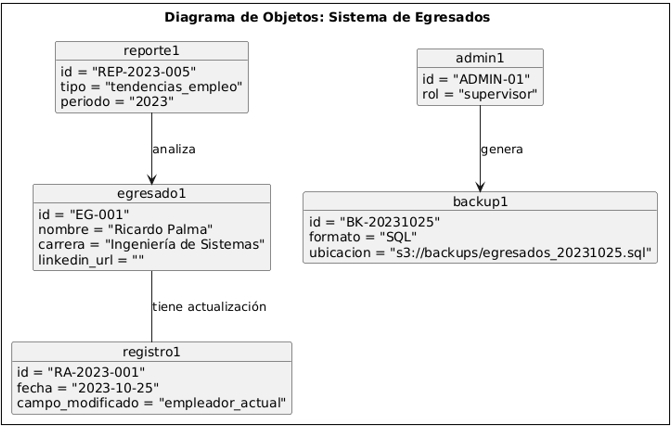
2. ### Diagrama de Clases	
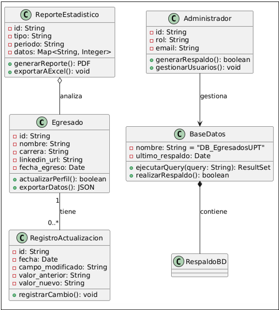

1. Vista de Implementación (vista de desarrollo)

   1. ### Diagrama de arquitectura software (paquetes)

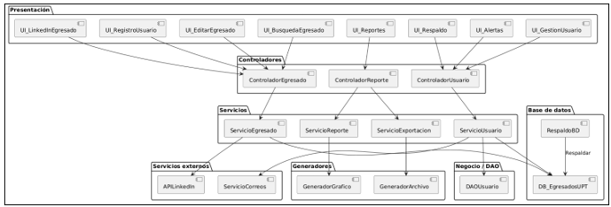

2. ### Diagrama de arquitectura del sistema (Diagrama de componentes)

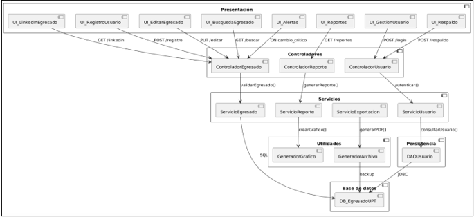

1. Vista de Despliegue (vista física)

   ### Diagrama de despliegue

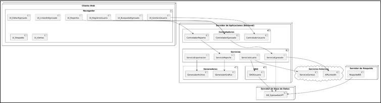

# **ATRIBUTOS DE CALIDAD DEL SOFTWARE**

**Escenario de Funcionalidad**

El sistema permitirá a los usuarios acceder a un conjunto de funcionalidades relacionadas con el análisis de perfiles profesionales de los egresados de la EPIS en LinkedIn. Entre las principales características se incluyen:

- Importación y análisis de datos públicos de LinkedIn, como competencias, cargos ocupados, áreas de especialización, instituciones educativas y ubicación geográfica.
- Generación de estadísticas comparativas y gráficos visuales (barras, pastel, líneas) sobre habilidades predominantes, áreas laborales más comunes y evolución profesional.
- Búsqueda avanzada y filtrado por carrera, año de egreso, país o empresa para realizar análisis más específicos.
- Exportación de resultados en formatos PDF o Excel para su uso académico o institucional.

El sistema garantizará la seguridad y privacidad de los datos recopilados, limitándose únicamente a la información pública disponible y cumpliendo con las normativas de uso de datos de la plataforma LinkedIn. Se implementarán mecanismos de validación de acceso para usuarios administrativos autorizados.

Este conjunto de funciones busca ofrecer un servicio general y robusto que apoye la toma de decisiones académicas, el rediseño curricular y la orientación profesional de los estudiantes y egresados.

**Escenario de Usabilidad**

El sistema está diseñado para que los usuarios, principalmente personal académico, egresados y estudiantes de la EPIS, puedan interactuar con él de forma intuitiva y rápida, sin necesidad de conocimientos técnicos avanzados.

- El usuario podrá navegar por las secciones del sistema (dashboard, filtros de búsqueda, resultados, exportación) mediante una interfaz gráfica limpia y estructurada.
- Se implementarán etiquetas claras, iconos representativos y mensajes de ayuda contextual que guíen al usuario en todo momento.
- El sistema contará con un panel de búsqueda guiada donde el usuario podrá seleccionar criterios como año de egreso, carrera, habilidades o países, con menús desplegables y sugerencias automáticas.
- En caso de error (como una búsqueda vacía o un filtro incompatible), el sistema mostrará mensajes explicativos con sugerencias para corregir la acción, minimizando frustraciones.
- Se evaluará la experiencia de usuario mediante pruebas piloto, con el objetivo de lograr que un usuario nuevo pueda realizar una consulta y generar un informe en menos de 5 minutos desde su primer ingreso.

Este enfoque busca fomentar la satisfacción del usuario, reducir el tiempo de aprendizaje del sistema y asegurar un uso eficiente incluso en usuarios con baja familiaridad tecnológica.

**Escenario de confiabilidad**

El sistema de análisis del perfil profesional de egresados de la EPIS en LinkedIn debe garantizar la seguridad, integridad y disponibilidad de los datos recopilados y generados durante su operación.

- Prevención:

Se establecerán políticas de acceso con autenticación de usuarios (credenciales seguras) y roles definidos (administrador, usuario invitado). El sistema también utilizará protocolos seguros (HTTPS) y validaciones tanto del lado cliente como servidor para prevenir ataques como inyecciones o accesos no autorizados.

- Precaución:

Toda la información recopilada, como datos estadísticos de perfiles públicos, será almacenada en una base de datos con respaldo periódico y con controles de integridad para evitar corrupción de datos.

Además, los datos sensibles o privados serán anonimizados o cifrados cuando corresponda, en cumplimiento con buenas prácticas éticas y normativas de protección de datos.

- Reacción:

Se integrará un sistema de logs para el monitoreo de accesos, errores y eventos importantes. Esto permitirá detectar actividades sospechosas y responder a incidentes en el menor tiempo posible. Asimismo, se podrá restaurar información desde los backups para minimizar pérdidas ante fallos técnicos.

Este enfoque asegura que el sistema mantenga la confidencialidad, integridad y disponibilidad, incluso ante situaciones imprevistas o maliciosas, proporcionando confianza a sus usuarios y stakeholders.

**Escenario de rendimiento**

El sistema deberá procesar grandes volúmenes de datos extraídos de perfiles públicos en LinkedIn de manera eficiente, asegurando una experiencia fluida y tiempos de respuesta adecuados para los usuarios.

- Velocidad de procesamiento:

El sistema debe ser capaz de analizar y clasificar la información de al menos 500 perfiles en menos de 5 minutos, incluyendo el procesamiento de texto, filtrado de datos y generación de estadísticas visuales.

- Tiempo de respuesta:

Al interactuar con el sistema (por ejemplo, al solicitar un reporte o visualizar un gráfico), el tiempo de respuesta no deberá exceder los 3 segundos en promedio, bajo condiciones normales de carga.

- Uso de recursos:

El sistema deberá utilizar los recursos de manera óptima, evitando picos innecesarios de CPU o consumo de memoria. Se priorizará el uso de consultas eficientes a la base de datos y procesamiento en segundo plano para tareas pesadas.

- Concurrencia:

El sistema debe ser capaz de atender a múltiples usuarios (mínimo 10 usuarios concurrentes) sin degradar significativamente su rendimiento ni afectar la disponibilidad del servicio.

- Eficiencia del sistema:

El diseño modular del sistema permitirá escalar componentes según sea necesario, y se aplicarán técnicas de almacenamiento en caché para reducir cargas repetitivas en el servidor.

Este enfoque asegura que el sistema sea ágil, eficiente y escalable, brindando una experiencia satisfactoria a sus usuarios en todo momento.

**Escenario de mantenibilidad**

El sistema de análisis de perfiles profesionales de egresados de la EPIS en LinkedIn será diseñado con un enfoque modular y documentado, para facilitar su mantenimiento, adaptación y evolución a lo largo del tiempo.

- Extensibilidad:

El sistema permitirá la incorporación de nuevos criterios de análisis (por ejemplo, nuevas habilidades, lenguajes de programación, certificaciones, etc.) sin necesidad de reestructurar su arquitectura principal. Se aplicará el principio de separación de responsabilidades en el código.

- Adaptabilidad:

El sistema podrá ajustarse fácilmente a cambios en las políticas de acceso a datos de LinkedIn, o integrarse con nuevas fuentes de información (por ejemplo, redes como Indeed o portales académicos), mediante el uso de servicios REST y una arquitectura desacoplada.

- Facilidad de corrección y mejora:

El sistema contará con documentación técnica clara, así como con pruebas unitarias y de integración automatizadas, que facilitarán la detección de errores y su corrección. Esto reducirá el tiempo y el riesgo al realizar actualizaciones.

- Modularidad:

Cada componente del sistema (extracción de datos, análisis, visualización, etc.) estará claramente separado y encapsulado, permitiendo que un desarrollador realice mejoras en una parte del sistema sin afectar a las demás.

- Registro de cambios:

Se implementará un sistema de control de versiones y una bitácora de cambios para documentar todas las modificaciones y facilitar la trazabilidad del mantenimiento.

Este escenario asegura que el sistema será fácil de mantener, escalar y adaptar, minimizando costos y tiempos de intervención en el futuro.

