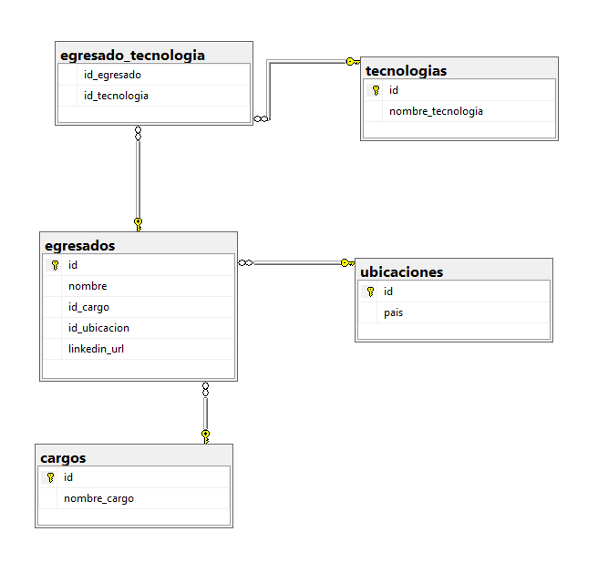
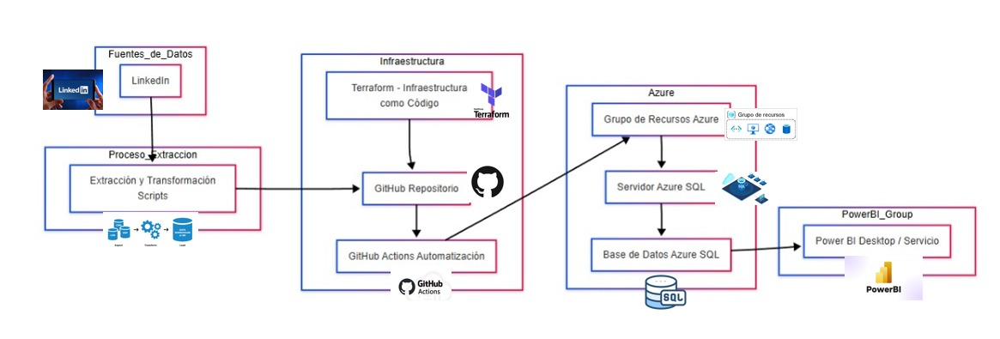
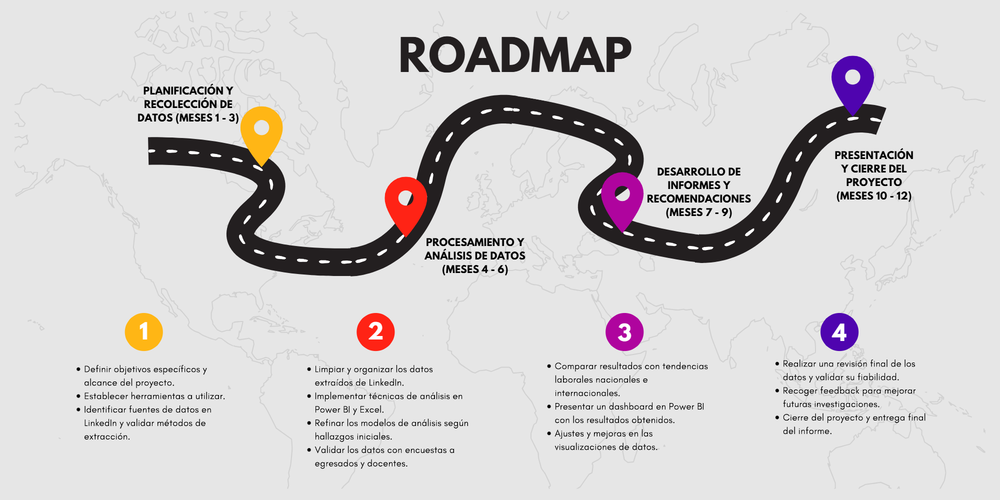

           
[comment]: 

# **UNIVERSIDAD PRIVADA DE TACNA**  
## **FACULTAD DE INGENIERÍA**  
### **ESCUELA PROFESIONAL DE INGENIERÍA DE SISTEMAS**  

---

# **ANÁLISIS DEL PERFIL PROFESIONAL DE LOS EGRESADOS DE LA EPIS DE LA UPT EN LINKEDIN**

## **Curso:** Inteligencia de Negocios  
## **Docente:** Mag. Patrick Cuadros Quiroga  

---
                        
### **Integrantes:**  
- **Villanueva Mamani, Royser Alonsso**  
- **Hinojosa Mucho, Christian Dennis**  
- **Chite Quispe, Brian Danilo** 
 
                        
## Objetivo Principal:
Evaluar el perfil profesional de los egresados de la EPIS de la UPT en LinkedIn para identificar sus habilidades, competencias, sectores laborales y trayectorias profesionales, y proponer estrategias para mejorar su posicionamiento en el mercado laboral.
         
## Objetivos Secundarios:
✅ Identificar las especializaciones profesionales más comunes entre los egresados registrados en LinkedIn, determinando los sectores o roles en los que predominan.

✅ Analizar las habilidades y competencias técnicas más utilizadas por los egresados según los perfiles registrados en LinkedIn

✅ Determinar la distribución geográfica de los egresados, clasificándola en local, nacional e internacional, para comprender mejor su presencia y alcance laboral.  

## Costos Terraform:

| Concepto                 | Costo Mensual (PEN) |
|-------------------------|---------------------|
| Trabajo con Terraform    | S/ 95               |
| Terraform Cloud (servicio) | S/ 76               |
| **Total**               | **S/ 171**          |

Nota: Solo si se sobrepasa el limite gratuito, de acuerdo a los recursos que se utilziarán.

## 📦 Inventario de Artefactos del Proyecto

| Código     | Nombre del Documento                                                | Tipo         | Enlace |
|------------|---------------------------------------------------------------------|--------------|--------|
| FD01       | Informe de Factibilidad                                             | PDF / DOCX   | [Ver PDF]("./FD01-EPIS-Informe de Factibilidad.pdf") / [Ver DOCX](./FD01-EPIS-Informe de Factibilidad.docx) |
| FD02       | Informe de Visión                                                   | PDF / DOCX   | [Ver PDF](./FD02-EPIS-Informe Vision.pdf) / [Ver DOCX](./FD02-EPIS-Informe Vision.docx) |
| FD03       | Informe de Especificación de Requerimientos                        | PDF / DOCX   | [Ver PDF](./FD03-EPIS-Informe Especificación Requerimientos.pdf) / [Ver DOCX](./FD03-EPIS-Informe Especificación Requerimientos.docx) |
| FD04       | Informe de Arquitectura de Software                                 | PDF / DOCX   | [Ver PDF](./FD04-EPIS-Informe Arquitectura de Software.pdf) / [Ver DOCX](./FD04-EPIS-Informe Arquitectura de Software.docx) |
| FD05       | Informe del Proyecto Final                                          | PDF / DOCX   | [Ver PDF](./FD05-EPIS-Informe ProyectoFinal.pdf) / [Ver DOCX](./FD05-EPIS-Informe ProyectoFinal.docx) |
| FD06       | Propuesta del Proyecto                                              | PDF / DOCX   | [Ver PDF](./FD06-EPIS-PropuestaProyecto.pdf) / [Ver DOCX](./FD06-EPIS-PropuestaProyecto.docx) |
| DATOS      | Diccionario de Datos                                                | MD / DOCX    | [Ver MD](./DICCIONARIO DE DATOS.md) / [Ver DOCX](./DICCIONARIO DE DATOS.docx) |
| PPT        | Presentación del Proyecto                                           | MD           | [Ver](./Presentacion.md) |
| DASHBOARD  | Dashboard Power BI                                                  | PBIX / Enlace | [Ver PBIX](./Dashboard_V2.pbix) / [Ver en línea](https://app.powerbi.com/links/Cg3PgMePDE?ctid=b6b466ee-468d-4011-b9fc-fbdcf82ac90a&pbi_source=linkShare) |
| ROADMAP    | Cronograma del Proyecto                                             | PNG          | [Ver](./descarga.png) |

### 📂 Base de Datos

| Archivo                 | Descripción                             | Tipo     | Enlace |
|------------------------|-----------------------------------------|----------|--------|
| egresados_upt.bak      | Respaldo completo de base de datos      | BAK      | [Descargar](./bd/egresados_upt.bak) |
| EgresadosUpt.sql       | Script de creación y carga de datos     | SQL      | [Descargar](./bd/EgresadosUpt.sql) |

> 📌 Todos los artefactos están organizados por tipo en carpetas (`media`, `infra`, `bd`, etc.) dentro del repositorio.

## RoadMap:

